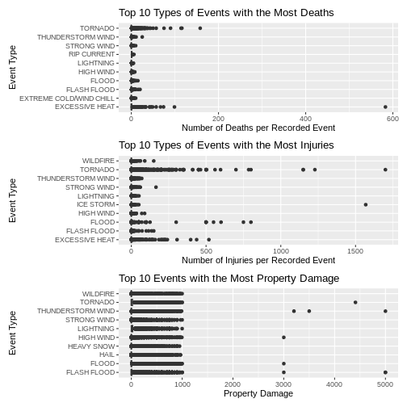
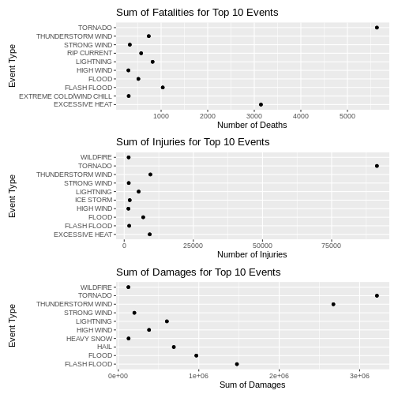

# Effects of NOAA Events (1950 - 2011) on Populations Health and Economic Impact

## Synopsis
### Every year, many different types of weather occur with varying effect on health of the population and economic impact. It is the hope that an accurate account of these events over the course of decades can provide an insight into any trends and help with forecasting furthur impact. With a successful analysis of the data provided by NOAA (National Ocean and Atmospheric Administration), I hope to identify areas of strong impact to both health and the economy of the U.S. as a whole. This study will analyze the trends of events based on the total sums of fatalities, injuries and property damage over the 61 years of the data. For this analysis, the events with the top 10 sums for each category have been used.

## Data Processing
### The data read in is pretty raw, and because of this requires some cleaning and simplifying to make it more useful for this analysis. 

```r
library(ggplot2)
library(patchwork)
library(knitr)

weather <- read.csv("repdata_data_StormData.csv.bz2")
```
### The number of unique different types of recorded events for the raw data is 985. Many of the events are very similar to others, but vary in spelling slightly or were recorded in a slightly different manner.

```r
unique(weather$EVTYPE)
```

```
##   [1] TORNADO                        TSTM WIND                     
##   [3] HAIL                           FREEZING RAIN                 
##   [5] SNOW                           ICE STORM/FLASH FLOOD         
##   [7] SNOW/ICE                       WINTER STORM                  
##   [9] HURRICANE OPAL/HIGH WINDS      THUNDERSTORM WINDS            
##  [11] RECORD COLD                    HURRICANE ERIN                
##  [13] HURRICANE OPAL                 HEAVY RAIN                    
##  [15] LIGHTNING                      THUNDERSTORM WIND             
##  [17] DENSE FOG                      RIP CURRENT                   
##  [19] THUNDERSTORM WINS              FLASH FLOOD                   
##  [21] FLASH FLOODING                 HIGH WINDS                    
##  [23] FUNNEL CLOUD                   TORNADO F0                    
##  [25] THUNDERSTORM WINDS LIGHTNING   THUNDERSTORM WINDS/HAIL       
##  [27] HEAT                           WIND                          
##  [29] LIGHTING                       HEAVY RAINS                   
##  [31] LIGHTNING AND HEAVY RAIN       FUNNEL                        
##  [33] WALL CLOUD                     FLOODING                      
##  [35] THUNDERSTORM WINDS HAIL        FLOOD                         
##  [37] COLD                           HEAVY RAIN/LIGHTNING          
##  [39] FLASH FLOODING/THUNDERSTORM WI WALL CLOUD/FUNNEL CLOUD       
##  [41] THUNDERSTORM                   WATERSPOUT                    
##  [43] EXTREME COLD                   HAIL 1.75)                    
##  [45] LIGHTNING/HEAVY RAIN           HIGH WIND                     
##  [47] BLIZZARD                       BLIZZARD WEATHER              
##  [49] WIND CHILL                     BREAKUP FLOODING              
##  [51] HIGH WIND/BLIZZARD             RIVER FLOOD                   
##  [53] HEAVY SNOW                     FREEZE                        
##  [55] COASTAL FLOOD                  HIGH WIND AND HIGH TIDES      
##  [57] HIGH WIND/BLIZZARD/FREEZING RA HIGH TIDES                    
##  [59] HIGH WIND AND HEAVY SNOW       RECORD COLD AND HIGH WIND     
##  [61] RECORD HIGH TEMPERATURE        RECORD HIGH                   
##  [63] HIGH WINDS HEAVY RAINS         HIGH WIND/ BLIZZARD           
##  [65] ICE STORM                      BLIZZARD/HIGH WIND            
##  [67] HIGH WIND/LOW WIND CHILL       HEAVY SNOW/HIGH               
##  [69] RECORD LOW                     HIGH WINDS AND WIND CHILL     
##  [71] HEAVY SNOW/HIGH WINDS/FREEZING LOW TEMPERATURE RECORD        
##  [73] AVALANCHE                      MARINE MISHAP                 
##  [75] WIND CHILL/HIGH WIND           HIGH WIND/WIND CHILL/BLIZZARD 
##  [77] HIGH WIND/WIND CHILL           HIGH WIND/HEAVY SNOW          
##  [79] HIGH TEMPERATURE RECORD        FLOOD WATCH/                  
##  [81] RECORD HIGH TEMPERATURES       HIGH WIND/SEAS                
##  [83] HIGH WINDS/HEAVY RAIN          HIGH SEAS                     
##  [85] SEVERE TURBULENCE              RECORD RAINFALL               
##  [87] RECORD SNOWFALL                RECORD WARMTH                 
##  [89] HEAVY SNOW/WIND                EXTREME HEAT                  
##  [91] WIND DAMAGE                    DUST STORM                    
##  [93] APACHE COUNTY                  SLEET                         
##  [95] HAIL STORM                     FUNNEL CLOUDS                 
##  [97] FLASH FLOODS                   DUST DEVIL                    
##  [99] EXCESSIVE HEAT                 THUNDERSTORM WINDS/FUNNEL CLOU
## [101] WINTER STORM/HIGH WIND         WINTER STORM/HIGH WINDS       
## [103] GUSTY WINDS                    STRONG WINDS                  
## [105] FLOODING/HEAVY RAIN            SNOW AND WIND                 
## [107] HEAVY SURF COASTAL FLOODING    HEAVY SURF                    
## [109] HEAVY PRECIPATATION            URBAN FLOODING                
## [111] HIGH SURF                      BLOWING DUST                  
## [113] URBAN/SMALL                    WILD FIRES                    
## [115] HIGH                           URBAN/SMALL FLOODING          
## [117] WATER SPOUT                    HIGH WINDS DUST STORM         
## [119] WINTER STORM HIGH WINDS        LOCAL FLOOD                   
## [121] WINTER STORMS                  MUDSLIDES                     
## [123] RAINSTORM                      SEVERE THUNDERSTORM           
## [125] SEVERE THUNDERSTORMS           SEVERE THUNDERSTORM WINDS     
## [127] THUNDERSTORMS WINDS            DRY MICROBURST                
## [129] FLOOD/FLASH FLOOD              FLOOD/RAIN/WINDS              
## [131] WINDS                          DRY MICROBURST 61             
## [133] THUNDERSTORMS                  FLASH FLOOD WINDS             
## [135] URBAN/SMALL STREAM FLOODING    MICROBURST                    
## [137] STRONG WIND                    HIGH WIND DAMAGE              
## [139] STREAM FLOODING                URBAN AND SMALL               
## [141] HEAVY SNOWPACK                 ICE                           
## [143] FLASH FLOOD/                   DOWNBURST                     
## [145] GUSTNADO AND                   FLOOD/RAIN/WIND               
## [147] WET MICROBURST                 DOWNBURST WINDS               
## [149] DRY MICROBURST WINDS           DRY MIRCOBURST WINDS          
## [151] DRY MICROBURST 53              SMALL STREAM URBAN FLOOD      
## [153] MICROBURST WINDS               HIGH WINDS 57                 
## [155] DRY MICROBURST 50              HIGH WINDS 66                 
## [157] HIGH WINDS 76                  HIGH WINDS 63                 
## [159] HIGH WINDS 67                  BLIZZARD/HEAVY SNOW           
## [161] HEAVY SNOW/HIGH WINDS          BLOWING SNOW                  
## [163] HIGH WINDS 82                  HIGH WINDS 80                 
## [165] HIGH WINDS 58                  FREEZING DRIZZLE              
## [167] LIGHTNING THUNDERSTORM WINDSS  DRY MICROBURST 58             
## [169] HAIL 75                        HIGH WINDS 73                 
## [171] HIGH WINDS 55                  LIGHT SNOW AND SLEET          
## [173] URBAN FLOOD                    DRY MICROBURST 84             
## [175] THUNDERSTORM WINDS 60          HEAVY RAIN/FLOODING           
## [177] THUNDERSTORM WINDSS            TORNADOS                      
## [179] GLAZE                          RECORD HEAT                   
## [181] COASTAL FLOODING               HEAT WAVE                     
## [183] FIRST SNOW                     FREEZING RAIN AND SLEET       
## [185] UNSEASONABLY DRY               UNSEASONABLY WET              
## [187] WINTRY MIX                     WINTER WEATHER                
## [189] UNSEASONABLY COLD              EXTREME/RECORD COLD           
## [191] RIP CURRENTS HEAVY SURF        SLEET/RAIN/SNOW               
## [193] UNSEASONABLY WARM              DROUGHT                       
## [195] NORMAL PRECIPITATION           HIGH WINDS/FLOODING           
## [197] DRY                            RAIN/SNOW                     
## [199] SNOW/RAIN/SLEET                WATERSPOUT/TORNADO            
## [201] WATERSPOUTS                    WATERSPOUT TORNADO            
## [203] URBAN/SMALL STREAM FLOOD       STORM SURGE                   
## [205] WATERSPOUT-TORNADO             WATERSPOUT-                   
## [207] TORNADOES, TSTM WIND, HAIL     TROPICAL STORM ALBERTO        
## [209] TROPICAL STORM                 TROPICAL STORM GORDON         
## [211] TROPICAL STORM JERRY           LIGHTNING THUNDERSTORM WINDS  
## [213] WAYTERSPOUT                    MINOR FLOODING                
## [215] LIGHTNING INJURY               URBAN/SMALL STREAM  FLOOD     
## [217] LIGHTNING AND THUNDERSTORM WIN THUNDERSTORM WINDS53          
## [219] URBAN AND SMALL STREAM FLOOD   URBAN AND SMALL STREAM        
## [221] WILDFIRE                       DAMAGING FREEZE               
## [223] THUNDERSTORM WINDS 13          SMALL HAIL                    
## [225] HEAVY SNOW/HIGH WIND           HURRICANE                     
## [227] WILD/FOREST FIRE               SMALL STREAM FLOODING         
## [229] MUD SLIDE                      LIGNTNING                     
## [231] FROST                          FREEZING RAIN/SNOW            
## [233] HIGH WINDS/                    THUNDERSNOW                   
## [235] FLOODS                         EXTREME WIND CHILLS           
## [237] COOL AND WET                   HEAVY RAIN/SNOW               
## [239] SMALL STREAM AND URBAN FLOODIN SMALL STREAM/URBAN FLOOD      
## [241] SNOW/SLEET/FREEZING RAIN       SEVERE COLD                   
## [243] GLAZE ICE                      COLD WAVE                     
## [245] EARLY SNOW                     SMALL STREAM AND URBAN FLOOD  
## [247] HIGH  WINDS                    RURAL FLOOD                   
## [249] SMALL STREAM AND               MUD SLIDES                    
## [251] HAIL 80                        EXTREME WIND CHILL            
## [253] COLD AND WET CONDITIONS        EXCESSIVE WETNESS             
## [255] GRADIENT WINDS                 HEAVY SNOW/BLOWING SNOW       
## [257] SLEET/ICE STORM                THUNDERSTORM WINDS URBAN FLOOD
## [259] THUNDERSTORM WINDS SMALL STREA ROTATING WALL CLOUD           
## [261] LARGE WALL CLOUD               COLD AIR FUNNEL               
## [263] GUSTNADO                       COLD AIR FUNNELS              
## [265] BLOWING SNOW- EXTREME WIND CHI SNOW AND HEAVY SNOW           
## [267] GROUND BLIZZARD                MAJOR FLOOD                   
## [269] SNOW/HEAVY SNOW                FREEZING RAIN/SLEET           
## [271] ICE JAM FLOODING               SNOW- HIGH WIND- WIND CHILL   
## [273] STREET FLOOD                   COLD AIR TORNADO              
## [275] SMALL STREAM FLOOD             FOG                           
## [277] THUNDERSTORM WINDS 2           FUNNEL CLOUD/HAIL             
## [279] ICE/SNOW                       TSTM WIND 51                  
## [281] TSTM WIND 50                   TSTM WIND 52                  
## [283] TSTM WIND 55                   HEAVY SNOW/BLIZZARD           
## [285] THUNDERSTORM WINDS 61          HAIL 0.75                     
## [287] THUNDERSTORM DAMAGE            THUNDERTORM WINDS             
## [289] HAIL 1.00                      HAIL/WINDS                    
## [291] SNOW AND ICE                   WIND STORM                    
## [293] SNOWSTORM                      GRASS FIRES                   
## [295] LAKE FLOOD                     PROLONG COLD                  
## [297] HAIL/WIND                      HAIL 1.75                     
## [299] THUNDERSTORMW 50               WIND/HAIL                     
## [301] SNOW AND ICE STORM             URBAN AND SMALL STREAM FLOODIN
## [303] THUNDERSTORMS WIND             THUNDERSTORM  WINDS           
## [305] HEAVY SNOW/SLEET               AGRICULTURAL FREEZE           
## [307] DROUGHT/EXCESSIVE HEAT         TUNDERSTORM WIND              
## [309] TROPICAL STORM DEAN            THUNDERTSORM WIND             
## [311] THUNDERSTORM WINDS/ HAIL       THUNDERSTORM WIND/LIGHTNING   
## [313] HEAVY RAIN/SEVERE WEATHER      THUNDESTORM WINDS             
## [315] WATERSPOUT/ TORNADO            LIGHTNING.                    
## [317] WARM DRY CONDITIONS            HURRICANE-GENERATED SWELLS    
## [319] HEAVY SNOW/ICE STORM           RIVER AND STREAM FLOOD        
## [321] HIGH WIND 63                   COASTAL SURGE                 
## [323] HEAVY SNOW AND ICE STORM       MINOR FLOOD                   
## [325] HIGH WINDS/COASTAL FLOOD       RAIN                          
## [327] RIVER FLOODING                 SNOW/RAIN                     
## [329] ICE FLOES                      HIGH WAVES                    
## [331] SNOW SQUALLS                   SNOW SQUALL                   
## [333] THUNDERSTORM WIND G50          LIGHTNING FIRE                
## [335] BLIZZARD/FREEZING RAIN         HEAVY LAKE SNOW               
## [337] HEAVY SNOW/FREEZING RAIN       LAKE EFFECT SNOW              
## [339] HEAVY WET SNOW                 DUST DEVIL WATERSPOUT         
## [341] THUNDERSTORM WINDS/HEAVY RAIN  THUNDERSTROM WINDS            
## [343] THUNDERSTORM WINDS      LE CEN HAIL 225                      
## [345] BLIZZARD AND HEAVY SNOW        HEAVY SNOW AND ICE            
## [347] ICE STORM AND SNOW             HEAVY SNOW ANDBLOWING SNOW    
## [349] HEAVY SNOW/ICE                 BLIZZARD AND EXTREME WIND CHIL
## [351] LOW WIND CHILL                 BLOWING SNOW & EXTREME WIND CH
## [353] WATERSPOUT/                    URBAN/SMALL STREAM            
## [355] TORNADO F3                     FUNNEL CLOUD.                 
## [357] TORNDAO                        HAIL 0.88                     
## [359] FLOOD/RIVER FLOOD              MUD SLIDES URBAN FLOODING     
## [361] TORNADO F1                     THUNDERSTORM WINDS G          
## [363] DEEP HAIL                      GLAZE/ICE STORM               
## [365] HEAVY SNOW/WINTER STORM        AVALANCE                      
## [367] BLIZZARD/WINTER STORM          DUST STORM/HIGH WINDS         
## [369] ICE JAM                        FOREST FIRES                  
## [371] THUNDERSTORM WIND G60          FROST\\FREEZE                 
## [373] THUNDERSTORM WINDS.            HAIL 88                       
## [375] HAIL 175                       HVY RAIN                      
## [377] HAIL 100                       HAIL 150                      
## [379] HAIL 075                       THUNDERSTORM WIND G55         
## [381] HAIL 125                       THUNDERSTORM WINDS G60        
## [383] HARD FREEZE                    HAIL 200                      
## [385] THUNDERSTORM WINDS FUNNEL CLOU THUNDERSTORM WINDS 62         
## [387] WILDFIRES                      RECORD HEAT WAVE              
## [389] HEAVY SNOW AND HIGH WINDS      HEAVY SNOW/HIGH WINDS & FLOOD 
## [391] HAIL FLOODING                  THUNDERSTORM WINDS/FLASH FLOOD
## [393] HIGH WIND 70                   WET SNOW                      
## [395] HEAVY RAIN AND FLOOD           LOCAL FLASH FLOOD             
## [397] THUNDERSTORM WINDS 53          FLOOD/FLASH FLOODING          
## [399] TORNADO/WATERSPOUT             RAIN AND WIND                 
## [401] THUNDERSTORM WIND 59           THUNDERSTORM WIND 52          
## [403] COASTAL/TIDAL FLOOD            SNOW/ICE STORM                
## [405] BELOW NORMAL PRECIPITATION     RIP CURRENTS/HEAVY SURF       
## [407] FLASH FLOOD/FLOOD              EXCESSIVE RAIN                
## [409] RECORD/EXCESSIVE HEAT          HEAT WAVES                    
## [411] LIGHT SNOW                     THUNDERSTORM WIND 69          
## [413] HAIL DAMAGE                    LIGHTNING DAMAGE              
## [415] RECORD TEMPERATURES            LIGHTNING AND WINDS           
## [417] FOG AND COLD TEMPERATURES      OTHER                         
## [419] RECORD SNOW                    SNOW/COLD                     
## [421] FLASH FLOOD FROM ICE JAMS      TSTM WIND G58                 
## [423] MUDSLIDE                       HEAVY SNOW SQUALLS            
## [425] HEAVY SNOW/SQUALLS             HEAVY SNOW-SQUALLS            
## [427] ICY ROADS                      HEAVY MIX                     
## [429] SNOW FREEZING RAIN             LACK OF SNOW                  
## [431] SNOW/SLEET                     SNOW/FREEZING RAIN            
## [433] SNOW DROUGHT                   THUNDERSTORMW WINDS           
## [435] THUNDERSTORM WIND 60 MPH       THUNDERSTORM WIND 65MPH       
## [437] THUNDERSTORM WIND/ TREES       THUNDERSTORM WIND/AWNING      
## [439] THUNDERSTORM WIND 98 MPH       THUNDERSTORM WIND TREES       
## [441] TORRENTIAL RAIN                TORNADO F2                    
## [443] RIP CURRENTS                   HURRICANE EMILY               
## [445] HURRICANE GORDON               HURRICANE FELIX               
## [447] THUNDERSTORM WIND 59 MPH       THUNDERSTORM WINDS 63 MPH     
## [449] THUNDERSTORM WIND/ TREE        THUNDERSTORM DAMAGE TO        
## [451] THUNDERSTORM WIND 65 MPH       FLASH FLOOD - HEAVY RAIN      
## [453] THUNDERSTORM WIND.             FLASH FLOOD/ STREET           
## [455] THUNDERSTORM WIND 59 MPH.      HEAVY SNOW   FREEZING RAIN    
## [457] DAM FAILURE                    THUNDERSTORM HAIL             
## [459] HAIL 088                       THUNDERSTORM WINDSHAIL        
## [461] LIGHTNING  WAUSEON             THUDERSTORM WINDS             
## [463] ICE AND SNOW                   RECORD COLD/FROST             
## [465] STORM FORCE WINDS              FREEZING RAIN AND SNOW        
## [467] FREEZING RAIN SLEET AND        SOUTHEAST                     
## [469] HEAVY SNOW & ICE               FREEZING DRIZZLE AND FREEZING 
## [471] THUNDERSTORM WINDS AND         HAIL/ICY ROADS                
## [473] FLASH FLOOD/HEAVY RAIN         HEAVY RAIN; URBAN FLOOD WINDS;
## [475] HEAVY PRECIPITATION            TSTM WIND DAMAGE              
## [477] HIGH WATER                     FLOOD FLASH                   
## [479] RAIN/WIND                      THUNDERSTORM WINDS 50         
## [481] THUNDERSTORM WIND G52          FLOOD FLOOD/FLASH             
## [483] THUNDERSTORM WINDS 52          SNOW SHOWERS                  
## [485] THUNDERSTORM WIND G51          HEAT WAVE DROUGHT             
## [487] HEAVY SNOW/BLIZZARD/AVALANCHE  RECORD SNOW/COLD              
## [489] WET WEATHER                    UNSEASONABLY WARM AND DRY     
## [491] FREEZING RAIN SLEET AND LIGHT  RECORD/EXCESSIVE RAINFALL     
## [493] TIDAL FLOOD                    BEACH EROSIN                  
## [495] THUNDERSTORM WIND G61          FLOOD/FLASH                   
## [497] LOW TEMPERATURE                SLEET & FREEZING RAIN         
## [499] HEAVY RAINS/FLOODING           THUNDERESTORM WINDS           
## [501] THUNDERSTORM WINDS/FLOODING    THUNDEERSTORM WINDS           
## [503] HIGHWAY FLOODING               THUNDERSTORM W INDS           
## [505] HYPOTHERMIA                    FLASH FLOOD/ FLOOD            
## [507] THUNDERSTORM WIND 50           THUNERSTORM WINDS             
## [509] HEAVY RAIN/MUDSLIDES/FLOOD     MUD/ROCK SLIDE                
## [511] HIGH WINDS/COLD                BEACH EROSION/COASTAL FLOOD   
## [513] COLD/WINDS                     SNOW/ BITTER COLD             
## [515] THUNDERSTORM WIND 56           SNOW SLEET                    
## [517] DRY HOT WEATHER                COLD WEATHER                  
## [519] RAPIDLY RISING WATER           HAIL ALOFT                    
## [521] EARLY FREEZE                   ICE/STRONG WINDS              
## [523] EXTREME WIND CHILL/BLOWING SNO SNOW/HIGH WINDS               
## [525] HIGH WINDS/SNOW                EARLY FROST                   
## [527] SNOWMELT FLOODING              HEAVY SNOW AND STRONG WINDS   
## [529] SNOW ACCUMULATION              BLOWING SNOW/EXTREME WIND CHIL
## [531] SNOW/ ICE                      SNOW/BLOWING SNOW             
## [533] TORNADOES                      THUNDERSTORM WIND/HAIL        
## [535] FLASH FLOODING/FLOOD           HAIL 275                      
## [537] HAIL 450                       FLASH FLOOODING               
## [539] EXCESSIVE RAINFALL             THUNDERSTORMW                 
## [541] HAILSTORM                      TSTM WINDS                    
## [543] BEACH FLOOD                    HAILSTORMS                    
## [545] TSTMW                          FUNNELS                       
## [547] TSTM WIND 65)                  THUNDERSTORM WINDS/ FLOOD     
## [549] HEAVY RAINFALL                 HEAT/DROUGHT                  
## [551] HEAT DROUGHT                   NEAR RECORD SNOW              
## [553] LANDSLIDE                      HIGH WIND AND SEAS            
## [555] THUNDERSTORMWINDS              THUNDERSTORM WINDS HEAVY RAIN 
## [557] SLEET/SNOW                     EXCESSIVE                     
## [559] SNOW/SLEET/RAIN                WILD/FOREST FIRES             
## [561] HEAVY SEAS                     DUSTSTORM                     
## [563] FLOOD & HEAVY RAIN             ?                             
## [565] THUNDERSTROM WIND              FLOOD/FLASHFLOOD              
## [567] SNOW AND COLD                  HOT PATTERN                   
## [569] PROLONG COLD/SNOW              BRUSH FIRES                   
## [571] SNOW\\COLD                     WINTER MIX                    
## [573] EXCESSIVE PRECIPITATION        SNOWFALL RECORD               
## [575] HOT/DRY PATTERN                DRY PATTERN                   
## [577] MILD/DRY PATTERN               MILD PATTERN                  
## [579] LANDSLIDES                     HEAVY SHOWERS                 
## [581] HEAVY SNOW AND                 HIGH WIND 48                  
## [583] LAKE-EFFECT SNOW               BRUSH FIRE                    
## [585] WATERSPOUT FUNNEL CLOUD        URBAN SMALL STREAM FLOOD      
## [587] SAHARAN DUST                   HEAVY SHOWER                  
## [589] URBAN FLOOD LANDSLIDE          HEAVY SWELLS                  
## [591] URBAN SMALL                    URBAN FLOODS                  
## [593] SMALL STREAM                   HEAVY RAIN/URBAN FLOOD        
## [595] FLASH FLOOD/LANDSLIDE          LANDSLIDE/URBAN FLOOD         
## [597] HEAVY RAIN/SMALL STREAM URBAN  FLASH FLOOD LANDSLIDES        
## [599] EXTREME WINDCHILL              URBAN/SML STREAM FLD          
## [601] TSTM WIND/HAIL                 Other                         
## [603] Record dry month               Temperature record            
## [605] Minor Flooding                 Ice jam flood (minor          
## [607] High Wind                      Tstm Wind                     
## [609] ROUGH SURF                     Wind                          
## [611] Heavy Surf                     Dust Devil                    
## [613] Wind Damage                    Marine Accident               
## [615] Snow                           Freeze                        
## [617] Snow Squalls                   Coastal Flooding              
## [619] Heavy Rain                     Strong Wind                   
## [621] COASTAL STORM                  COASTALFLOOD                  
## [623] Erosion/Cstl Flood             Heavy Rain and Wind           
## [625] Light Snow/Flurries            Wet Month                     
## [627] Wet Year                       Tidal Flooding                
## [629] River Flooding                 Damaging Freeze               
## [631] Beach Erosion                  Hot and Dry                   
## [633] Flood/Flash Flood              Icy Roads                     
## [635] High Surf                      Heavy Rain/High Surf          
## [637] Thunderstorm Wind              Rain Damage                   
## [639] Unseasonable Cold              Early Frost                   
## [641] Wintry Mix                     blowing snow                  
## [643] STREET FLOODING                Record Cold                   
## [645] Extreme Cold                   Ice Fog                       
## [647] Excessive Cold                 Torrential Rainfall           
## [649] Freezing Rain                  Landslump                     
## [651] Late-season Snowfall           Hurricane Edouard             
## [653] Coastal Storm                  Flood                         
## [655] HEAVY RAIN/WIND                TIDAL FLOODING                
## [657] Winter Weather                 Snow squalls                  
## [659] Strong Winds                   Strong winds                  
## [661] RECORD WARM TEMPS.             Ice/Snow                      
## [663] Mudslide                       Glaze                         
## [665] Extended Cold                  Snow Accumulation             
## [667] Freezing Fog                   Drifting Snow                 
## [669] Whirlwind                      Heavy snow shower             
## [671] Heavy rain                     LATE SNOW                     
## [673] Record May Snow                Record Winter Snow            
## [675] Heavy Precipitation             COASTAL FLOOD                
## [677] Record temperature             Light snow                    
## [679] Late Season Snowfall           Gusty Wind                    
## [681] small hail                     Light Snow                    
## [683] MIXED PRECIP                   Black Ice                     
## [685] Mudslides                      Gradient wind                 
## [687] Snow and Ice                   Freezing Spray                
## [689] Summary Jan 17                 Summary of March 14           
## [691] Summary of March 23            Summary of March 24           
## [693] Summary of April 3rd           Summary of April 12           
## [695] Summary of April 13            Summary of April 21           
## [697] Summary August 11              Summary of April 27           
## [699] Summary of May 9-10            Summary of May 10             
## [701] Summary of May 13              Summary of May 14             
## [703] Summary of May 22 am           Summary of May 22 pm          
## [705] Heatburst                      Summary of May 26 am          
## [707] Summary of May 26 pm           Metro Storm, May 26           
## [709] Summary of May 31 am           Summary of May 31 pm          
## [711] Summary of June 3              Summary of June 4             
## [713] Summary June 5-6               Summary June 6                
## [715] Summary of June 11             Summary of June 12            
## [717] Summary of June 13             Summary of June 15            
## [719] Summary of June 16             Summary June 18-19            
## [721] Summary of June 23             Summary of June 24            
## [723] Summary of June 30             Summary of July 2             
## [725] Summary of July 3              Summary of July 11            
## [727] Summary of July 22             Summary July 23-24            
## [729] Summary of July 26             Summary of July 29            
## [731] Summary of August 1            Summary August 2-3            
## [733] Summary August 7               Summary August 9              
## [735] Summary August 10              Summary August 17             
## [737] Summary August 21              Summary August 28             
## [739] Summary September 4            Summary September 20          
## [741] Summary September 23           Summary Sept. 25-26           
## [743] Summary: Oct. 20-21            Summary: October 31           
## [745] Summary: Nov. 6-7              Summary: Nov. 16              
## [747] Microburst                     wet micoburst                 
## [749] Hail(0.75)                     Funnel Cloud                  
## [751] Urban Flooding                 No Severe Weather             
## [753] Urban flood                    Urban Flood                   
## [755] Cold                           Summary of May 22             
## [757] Summary of June 6              Summary August 4              
## [759] Summary of June 10             Summary of June 18            
## [761] Summary September 3            Summary: Sept. 18             
## [763] Coastal Flood                  coastal flooding              
## [765] Small Hail                     Record Temperatures           
## [767] Light Snowfall                 Freezing Drizzle              
## [769] Gusty wind/rain                GUSTY WIND/HVY RAIN           
## [771] Blowing Snow                   Early snowfall                
## [773] Monthly Snowfall               Record Heat                   
## [775] Seasonal Snowfall              Monthly Rainfall              
## [777] Cold Temperature               Sml Stream Fld                
## [779] Heat Wave                      MUDSLIDE/LANDSLIDE            
## [781] Saharan Dust                   Volcanic Ash                  
## [783] Volcanic Ash Plume             Thundersnow shower            
## [785] NONE                           COLD AND SNOW                 
## [787] DAM BREAK                      TSTM WIND (G45)               
## [789] SLEET/FREEZING RAIN            BLACK ICE                     
## [791] BLOW-OUT TIDES                 UNSEASONABLY COOL             
## [793] TSTM HEAVY RAIN                Gusty Winds                   
## [795] GUSTY WIND                     TSTM WIND 40                  
## [797] TSTM WIND 45                   TSTM WIND (41)                
## [799] TSTM WIND (G40)                TSTM WND                      
## [801] Wintry mix                      TSTM WIND                    
## [803] Frost                          Frost/Freeze                  
## [805] RAIN (HEAVY)                   Record Warmth                 
## [807] Prolong Cold                   Cold and Frost                
## [809] URBAN/SML STREAM FLDG          STRONG WIND GUST              
## [811] LATE FREEZE                    BLOW-OUT TIDE                 
## [813] Hypothermia/Exposure           HYPOTHERMIA/EXPOSURE          
## [815] Lake Effect Snow               Mixed Precipitation           
## [817] Record High                    COASTALSTORM                  
## [819] Snow and sleet                 Freezing rain                 
## [821] Gusty winds                    Blizzard Summary              
## [823] SUMMARY OF MARCH 24-25         SUMMARY OF MARCH 27           
## [825] SUMMARY OF MARCH 29            GRADIENT WIND                 
## [827] Icestorm/Blizzard              Flood/Strong Wind             
## [829] TSTM WIND AND LIGHTNING        gradient wind                 
## [831] Freezing drizzle               Mountain Snows                
## [833] URBAN/SMALL STRM FLDG          Heavy surf and wind           
## [835] Mild and Dry Pattern           COLD AND FROST                
## [837] TYPHOON                        HIGH SWELLS                   
## [839] HIGH  SWELLS                   VOLCANIC ASH                  
## [841] DRY SPELL                       LIGHTNING                    
## [843] BEACH EROSION                  UNSEASONAL RAIN               
## [845] EARLY RAIN                     PROLONGED RAIN                
## [847] WINTERY MIX                    COASTAL FLOODING/EROSION      
## [849] HOT SPELL                      UNSEASONABLY HOT              
## [851]  TSTM WIND (G45)               TSTM WIND  (G45)              
## [853] HIGH WIND (G40)                TSTM WIND (G35)               
## [855] DRY WEATHER                    ABNORMAL WARMTH               
## [857] UNUSUAL WARMTH                 WAKE LOW WIND                 
## [859] MONTHLY RAINFALL               COLD TEMPERATURES             
## [861] COLD WIND CHILL TEMPERATURES   MODERATE SNOW                 
## [863] MODERATE SNOWFALL              URBAN/STREET FLOODING         
## [865] COASTAL EROSION                UNUSUAL/RECORD WARMTH         
## [867] BITTER WIND CHILL              BITTER WIND CHILL TEMPERATURES
## [869] SEICHE                         TSTM                          
## [871] COASTAL  FLOODING/EROSION      UNSEASONABLY WARM YEAR        
## [873] HYPERTHERMIA/EXPOSURE          ROCK SLIDE                    
## [875] ICE PELLETS                    PATCHY DENSE FOG              
## [877] RECORD COOL                    RECORD WARM                   
## [879] HOT WEATHER                    RECORD TEMPERATURE            
## [881] TROPICAL DEPRESSION            VOLCANIC ERUPTION             
## [883] COOL SPELL                     WIND ADVISORY                 
## [885] GUSTY WIND/HAIL                RED FLAG FIRE WX              
## [887] FIRST FROST                    EXCESSIVELY DRY               
## [889] SNOW AND SLEET                 LIGHT SNOW/FREEZING PRECIP    
## [891] VOG                            MONTHLY PRECIPITATION         
## [893] MONTHLY TEMPERATURE            RECORD DRYNESS                
## [895] EXTREME WINDCHILL TEMPERATURES MIXED PRECIPITATION           
## [897] DRY CONDITIONS                 REMNANTS OF FLOYD             
## [899] EARLY SNOWFALL                 FREEZING FOG                  
## [901] LANDSPOUT                      DRIEST MONTH                  
## [903] RECORD  COLD                   LATE SEASON HAIL              
## [905] EXCESSIVE SNOW                 DRYNESS                       
## [907] FLOOD/FLASH/FLOOD              WIND AND WAVE                 
## [909] LIGHT FREEZING RAIN             WIND                         
## [911] MONTHLY SNOWFALL               RECORD PRECIPITATION          
## [913] ICE ROADS                      ROUGH SEAS                    
## [915] UNSEASONABLY WARM/WET          UNSEASONABLY COOL & WET       
## [917] UNUSUALLY WARM                 TSTM WIND G45                 
## [919] NON SEVERE HAIL                NON-SEVERE WIND DAMAGE        
## [921] UNUSUALLY COLD                 WARM WEATHER                  
## [923] LANDSLUMP                      THUNDERSTORM WIND (G40)       
## [925] UNSEASONABLY WARM & WET         FLASH FLOOD                  
## [927] LOCALLY HEAVY RAIN             WIND GUSTS                    
## [929] UNSEASONAL LOW TEMP            HIGH SURF ADVISORY            
## [931] LATE SEASON SNOW               GUSTY LAKE WIND               
## [933] ABNORMALLY DRY                 WINTER WEATHER MIX            
## [935] RED FLAG CRITERIA              WND                           
## [937] CSTL FLOODING/EROSION          SMOKE                         
## [939]  WATERSPOUT                    SNOW ADVISORY                 
## [941] EXTREMELY WET                  UNUSUALLY LATE SNOW           
## [943] VERY DRY                       RECORD LOW RAINFALL           
## [945] ROGUE WAVE                     PROLONG WARMTH                
## [947] ACCUMULATED SNOWFALL           FALLING SNOW/ICE              
## [949] DUST DEVEL                     NON-TSTM WIND                 
## [951] NON TSTM WIND                  GUSTY THUNDERSTORM WINDS      
## [953] PATCHY ICE                     HEAVY RAIN EFFECTS            
## [955] EXCESSIVE HEAT/DROUGHT         NORTHERN LIGHTS               
## [957] MARINE TSTM WIND                  HIGH SURF ADVISORY         
## [959] HAZARDOUS SURF                 FROST/FREEZE                  
## [961] WINTER WEATHER/MIX             ASTRONOMICAL HIGH TIDE        
## [963] WHIRLWIND                      VERY WARM                     
## [965] ABNORMALLY WET                 TORNADO DEBRIS                
## [967] EXTREME COLD/WIND CHILL        ICE ON ROAD                   
## [969] DROWNING                       GUSTY THUNDERSTORM WIND       
## [971] MARINE HAIL                    HIGH SURF ADVISORIES          
## [973] HURRICANE/TYPHOON              HEAVY SURF/HIGH SURF          
## [975] SLEET STORM                    STORM SURGE/TIDE              
## [977] COLD/WIND CHILL                MARINE HIGH WIND              
## [979] TSUNAMI                        DENSE SMOKE                   
## [981] LAKESHORE FLOOD                MARINE THUNDERSTORM WIND      
## [983] MARINE STRONG WIND             ASTRONOMICAL LOW TIDE         
## [985] VOLCANIC ASHFALL              
## 985 Levels:    HIGH SURF ADVISORY  COASTAL FLOOD ... WND
```

### The first step in simplifying the event list is to make the format consistent. In this case, I have converted all to upper case. This one change drops the unique values for event types to 897.

```r
weather['EVTYPE'] <- toupper(weather$EVTYPE)
unique(weather$EVTYPE)
```

```
##   [1] "TORNADO"                        "TSTM WIND"                     
##   [3] "HAIL"                           "FREEZING RAIN"                 
##   [5] "SNOW"                           "ICE STORM/FLASH FLOOD"         
##   [7] "SNOW/ICE"                       "WINTER STORM"                  
##   [9] "HURRICANE OPAL/HIGH WINDS"      "THUNDERSTORM WINDS"            
##  [11] "RECORD COLD"                    "HURRICANE ERIN"                
##  [13] "HURRICANE OPAL"                 "HEAVY RAIN"                    
##  [15] "LIGHTNING"                      "THUNDERSTORM WIND"             
##  [17] "DENSE FOG"                      "RIP CURRENT"                   
##  [19] "THUNDERSTORM WINS"              "FLASH FLOOD"                   
##  [21] "FLASH FLOODING"                 "HIGH WINDS"                    
##  [23] "FUNNEL CLOUD"                   "TORNADO F0"                    
##  [25] "THUNDERSTORM WINDS LIGHTNING"   "THUNDERSTORM WINDS/HAIL"       
##  [27] "HEAT"                           "WIND"                          
##  [29] "LIGHTING"                       "HEAVY RAINS"                   
##  [31] "LIGHTNING AND HEAVY RAIN"       "FUNNEL"                        
##  [33] "WALL CLOUD"                     "FLOODING"                      
##  [35] "THUNDERSTORM WINDS HAIL"        "FLOOD"                         
##  [37] "COLD"                           "HEAVY RAIN/LIGHTNING"          
##  [39] "FLASH FLOODING/THUNDERSTORM WI" "WALL CLOUD/FUNNEL CLOUD"       
##  [41] "THUNDERSTORM"                   "WATERSPOUT"                    
##  [43] "EXTREME COLD"                   "HAIL 1.75)"                    
##  [45] "LIGHTNING/HEAVY RAIN"           "HIGH WIND"                     
##  [47] "BLIZZARD"                       "BLIZZARD WEATHER"              
##  [49] "WIND CHILL"                     "BREAKUP FLOODING"              
##  [51] "HIGH WIND/BLIZZARD"             "RIVER FLOOD"                   
##  [53] "HEAVY SNOW"                     "FREEZE"                        
##  [55] "COASTAL FLOOD"                  "HIGH WIND AND HIGH TIDES"      
##  [57] "HIGH WIND/BLIZZARD/FREEZING RA" "HIGH TIDES"                    
##  [59] "HIGH WIND AND HEAVY SNOW"       "RECORD COLD AND HIGH WIND"     
##  [61] "RECORD HIGH TEMPERATURE"        "RECORD HIGH"                   
##  [63] "HIGH WINDS HEAVY RAINS"         "HIGH WIND/ BLIZZARD"           
##  [65] "ICE STORM"                      "BLIZZARD/HIGH WIND"            
##  [67] "HIGH WIND/LOW WIND CHILL"       "HEAVY SNOW/HIGH"               
##  [69] "RECORD LOW"                     "HIGH WINDS AND WIND CHILL"     
##  [71] "HEAVY SNOW/HIGH WINDS/FREEZING" "LOW TEMPERATURE RECORD"        
##  [73] "AVALANCHE"                      "MARINE MISHAP"                 
##  [75] "WIND CHILL/HIGH WIND"           "HIGH WIND/WIND CHILL/BLIZZARD" 
##  [77] "HIGH WIND/WIND CHILL"           "HIGH WIND/HEAVY SNOW"          
##  [79] "HIGH TEMPERATURE RECORD"        "FLOOD WATCH/"                  
##  [81] "RECORD HIGH TEMPERATURES"       "HIGH WIND/SEAS"                
##  [83] "HIGH WINDS/HEAVY RAIN"          "HIGH SEAS"                     
##  [85] "SEVERE TURBULENCE"              "RECORD RAINFALL"               
##  [87] "RECORD SNOWFALL"                "RECORD WARMTH"                 
##  [89] "HEAVY SNOW/WIND"                "EXTREME HEAT"                  
##  [91] "WIND DAMAGE"                    "DUST STORM"                    
##  [93] "APACHE COUNTY"                  "SLEET"                         
##  [95] "HAIL STORM"                     "FUNNEL CLOUDS"                 
##  [97] "FLASH FLOODS"                   "DUST DEVIL"                    
##  [99] "EXCESSIVE HEAT"                 "THUNDERSTORM WINDS/FUNNEL CLOU"
## [101] "WINTER STORM/HIGH WIND"         "WINTER STORM/HIGH WINDS"       
## [103] "GUSTY WINDS"                    "STRONG WINDS"                  
## [105] "FLOODING/HEAVY RAIN"            "SNOW AND WIND"                 
## [107] "HEAVY SURF COASTAL FLOODING"    "HEAVY SURF"                    
## [109] "HEAVY PRECIPATATION"            "URBAN FLOODING"                
## [111] "HIGH SURF"                      "BLOWING DUST"                  
## [113] "URBAN/SMALL"                    "WILD FIRES"                    
## [115] "HIGH"                           "URBAN/SMALL FLOODING"          
## [117] "WATER SPOUT"                    "HIGH WINDS DUST STORM"         
## [119] "WINTER STORM HIGH WINDS"        "LOCAL FLOOD"                   
## [121] "WINTER STORMS"                  "MUDSLIDES"                     
## [123] "RAINSTORM"                      "SEVERE THUNDERSTORM"           
## [125] "SEVERE THUNDERSTORMS"           "SEVERE THUNDERSTORM WINDS"     
## [127] "THUNDERSTORMS WINDS"            "DRY MICROBURST"                
## [129] "FLOOD/FLASH FLOOD"              "FLOOD/RAIN/WINDS"              
## [131] "WINDS"                          "DRY MICROBURST 61"             
## [133] "THUNDERSTORMS"                  "FLASH FLOOD WINDS"             
## [135] "URBAN/SMALL STREAM FLOODING"    "MICROBURST"                    
## [137] "STRONG WIND"                    "HIGH WIND DAMAGE"              
## [139] "STREAM FLOODING"                "URBAN AND SMALL"               
## [141] "HEAVY SNOWPACK"                 "ICE"                           
## [143] "FLASH FLOOD/"                   "DOWNBURST"                     
## [145] "GUSTNADO AND"                   "FLOOD/RAIN/WIND"               
## [147] "WET MICROBURST"                 "DOWNBURST WINDS"               
## [149] "DRY MICROBURST WINDS"           "DRY MIRCOBURST WINDS"          
## [151] "DRY MICROBURST 53"              "SMALL STREAM URBAN FLOOD"      
## [153] "MICROBURST WINDS"               "HIGH WINDS 57"                 
## [155] "DRY MICROBURST 50"              "HIGH WINDS 66"                 
## [157] "HIGH WINDS 76"                  "HIGH WINDS 63"                 
## [159] "HIGH WINDS 67"                  "BLIZZARD/HEAVY SNOW"           
## [161] "HEAVY SNOW/HIGH WINDS"          "BLOWING SNOW"                  
## [163] "HIGH WINDS 82"                  "HIGH WINDS 80"                 
## [165] "HIGH WINDS 58"                  "FREEZING DRIZZLE"              
## [167] "LIGHTNING THUNDERSTORM WINDSS"  "DRY MICROBURST 58"             
## [169] "HAIL 75"                        "HIGH WINDS 73"                 
## [171] "HIGH WINDS 55"                  "LIGHT SNOW AND SLEET"          
## [173] "URBAN FLOOD"                    "DRY MICROBURST 84"             
## [175] "THUNDERSTORM WINDS 60"          "HEAVY RAIN/FLOODING"           
## [177] "THUNDERSTORM WINDSS"            "TORNADOS"                      
## [179] "GLAZE"                          "RECORD HEAT"                   
## [181] "COASTAL FLOODING"               "HEAT WAVE"                     
## [183] "FIRST SNOW"                     "FREEZING RAIN AND SLEET"       
## [185] "UNSEASONABLY DRY"               "UNSEASONABLY WET"              
## [187] "WINTRY MIX"                     "WINTER WEATHER"                
## [189] "UNSEASONABLY COLD"              "EXTREME/RECORD COLD"           
## [191] "RIP CURRENTS HEAVY SURF"        "SLEET/RAIN/SNOW"               
## [193] "UNSEASONABLY WARM"              "DROUGHT"                       
## [195] "NORMAL PRECIPITATION"           "HIGH WINDS/FLOODING"           
## [197] "DRY"                            "RAIN/SNOW"                     
## [199] "SNOW/RAIN/SLEET"                "WATERSPOUT/TORNADO"            
## [201] "WATERSPOUTS"                    "WATERSPOUT TORNADO"            
## [203] "URBAN/SMALL STREAM FLOOD"       "STORM SURGE"                   
## [205] "WATERSPOUT-TORNADO"             "WATERSPOUT-"                   
## [207] "TORNADOES, TSTM WIND, HAIL"     "TROPICAL STORM ALBERTO"        
## [209] "TROPICAL STORM"                 "TROPICAL STORM GORDON"         
## [211] "TROPICAL STORM JERRY"           "LIGHTNING THUNDERSTORM WINDS"  
## [213] "WAYTERSPOUT"                    "MINOR FLOODING"                
## [215] "LIGHTNING INJURY"               "URBAN/SMALL STREAM  FLOOD"     
## [217] "LIGHTNING AND THUNDERSTORM WIN" "THUNDERSTORM WINDS53"          
## [219] "URBAN AND SMALL STREAM FLOOD"   "URBAN AND SMALL STREAM"        
## [221] "WILDFIRE"                       "DAMAGING FREEZE"               
## [223] "THUNDERSTORM WINDS 13"          "SMALL HAIL"                    
## [225] "HEAVY SNOW/HIGH WIND"           "HURRICANE"                     
## [227] "WILD/FOREST FIRE"               "SMALL STREAM FLOODING"         
## [229] "MUD SLIDE"                      "LIGNTNING"                     
## [231] "FROST"                          "FREEZING RAIN/SNOW"            
## [233] "HIGH WINDS/"                    "THUNDERSNOW"                   
## [235] "FLOODS"                         "EXTREME WIND CHILLS"           
## [237] "COOL AND WET"                   "HEAVY RAIN/SNOW"               
## [239] "SMALL STREAM AND URBAN FLOODIN" "SMALL STREAM/URBAN FLOOD"      
## [241] "SNOW/SLEET/FREEZING RAIN"       "SEVERE COLD"                   
## [243] "GLAZE ICE"                      "COLD WAVE"                     
## [245] "EARLY SNOW"                     "SMALL STREAM AND URBAN FLOOD"  
## [247] "HIGH  WINDS"                    "RURAL FLOOD"                   
## [249] "SMALL STREAM AND"               "MUD SLIDES"                    
## [251] "HAIL 80"                        "EXTREME WIND CHILL"            
## [253] "COLD AND WET CONDITIONS"        "EXCESSIVE WETNESS"             
## [255] "GRADIENT WINDS"                 "HEAVY SNOW/BLOWING SNOW"       
## [257] "SLEET/ICE STORM"                "THUNDERSTORM WINDS URBAN FLOOD"
## [259] "THUNDERSTORM WINDS SMALL STREA" "ROTATING WALL CLOUD"           
## [261] "LARGE WALL CLOUD"               "COLD AIR FUNNEL"               
## [263] "GUSTNADO"                       "COLD AIR FUNNELS"              
## [265] "BLOWING SNOW- EXTREME WIND CHI" "SNOW AND HEAVY SNOW"           
## [267] "GROUND BLIZZARD"                "MAJOR FLOOD"                   
## [269] "SNOW/HEAVY SNOW"                "FREEZING RAIN/SLEET"           
## [271] "ICE JAM FLOODING"               "SNOW- HIGH WIND- WIND CHILL"   
## [273] "STREET FLOOD"                   "COLD AIR TORNADO"              
## [275] "SMALL STREAM FLOOD"             "FOG"                           
## [277] "THUNDERSTORM WINDS 2"           "FUNNEL CLOUD/HAIL"             
## [279] "ICE/SNOW"                       "TSTM WIND 51"                  
## [281] "TSTM WIND 50"                   "TSTM WIND 52"                  
## [283] "TSTM WIND 55"                   "HEAVY SNOW/BLIZZARD"           
## [285] "THUNDERSTORM WINDS 61"          "HAIL 0.75"                     
## [287] "THUNDERSTORM DAMAGE"            "THUNDERTORM WINDS"             
## [289] "HAIL 1.00"                      "HAIL/WINDS"                    
## [291] "SNOW AND ICE"                   "WIND STORM"                    
## [293] "SNOWSTORM"                      "GRASS FIRES"                   
## [295] "LAKE FLOOD"                     "PROLONG COLD"                  
## [297] "HAIL/WIND"                      "HAIL 1.75"                     
## [299] "THUNDERSTORMW 50"               "WIND/HAIL"                     
## [301] "SNOW AND ICE STORM"             "URBAN AND SMALL STREAM FLOODIN"
## [303] "THUNDERSTORMS WIND"             "THUNDERSTORM  WINDS"           
## [305] "HEAVY SNOW/SLEET"               "AGRICULTURAL FREEZE"           
## [307] "DROUGHT/EXCESSIVE HEAT"         "TUNDERSTORM WIND"              
## [309] "TROPICAL STORM DEAN"            "THUNDERTSORM WIND"             
## [311] "THUNDERSTORM WINDS/ HAIL"       "THUNDERSTORM WIND/LIGHTNING"   
## [313] "HEAVY RAIN/SEVERE WEATHER"      "THUNDESTORM WINDS"             
## [315] "WATERSPOUT/ TORNADO"            "LIGHTNING."                    
## [317] "WARM DRY CONDITIONS"            "HURRICANE-GENERATED SWELLS"    
## [319] "HEAVY SNOW/ICE STORM"           "RIVER AND STREAM FLOOD"        
## [321] "HIGH WIND 63"                   "COASTAL SURGE"                 
## [323] "HEAVY SNOW AND ICE STORM"       "MINOR FLOOD"                   
## [325] "HIGH WINDS/COASTAL FLOOD"       "RAIN"                          
## [327] "RIVER FLOODING"                 "SNOW/RAIN"                     
## [329] "ICE FLOES"                      "HIGH WAVES"                    
## [331] "SNOW SQUALLS"                   "SNOW SQUALL"                   
## [333] "THUNDERSTORM WIND G50"          "LIGHTNING FIRE"                
## [335] "BLIZZARD/FREEZING RAIN"         "HEAVY LAKE SNOW"               
## [337] "HEAVY SNOW/FREEZING RAIN"       "LAKE EFFECT SNOW"              
## [339] "HEAVY WET SNOW"                 "DUST DEVIL WATERSPOUT"         
## [341] "THUNDERSTORM WINDS/HEAVY RAIN"  "THUNDERSTROM WINDS"            
## [343] "THUNDERSTORM WINDS      LE CEN" "HAIL 225"                      
## [345] "BLIZZARD AND HEAVY SNOW"        "HEAVY SNOW AND ICE"            
## [347] "ICE STORM AND SNOW"             "HEAVY SNOW ANDBLOWING SNOW"    
## [349] "HEAVY SNOW/ICE"                 "BLIZZARD AND EXTREME WIND CHIL"
## [351] "LOW WIND CHILL"                 "BLOWING SNOW & EXTREME WIND CH"
## [353] "WATERSPOUT/"                    "URBAN/SMALL STREAM"            
## [355] "TORNADO F3"                     "FUNNEL CLOUD."                 
## [357] "TORNDAO"                        "HAIL 0.88"                     
## [359] "FLOOD/RIVER FLOOD"              "MUD SLIDES URBAN FLOODING"     
## [361] "TORNADO F1"                     "THUNDERSTORM WINDS G"          
## [363] "DEEP HAIL"                      "GLAZE/ICE STORM"               
## [365] "HEAVY SNOW/WINTER STORM"        "AVALANCE"                      
## [367] "BLIZZARD/WINTER STORM"          "DUST STORM/HIGH WINDS"         
## [369] "ICE JAM"                        "FOREST FIRES"                  
## [371] "THUNDERSTORM WIND G60"          "FROST\\FREEZE"                 
## [373] "THUNDERSTORM WINDS."            "HAIL 88"                       
## [375] "HAIL 175"                       "HVY RAIN"                      
## [377] "HAIL 100"                       "HAIL 150"                      
## [379] "HAIL 075"                       "THUNDERSTORM WIND G55"         
## [381] "HAIL 125"                       "THUNDERSTORM WINDS G60"        
## [383] "HARD FREEZE"                    "HAIL 200"                      
## [385] "THUNDERSTORM WINDS FUNNEL CLOU" "THUNDERSTORM WINDS 62"         
## [387] "WILDFIRES"                      "RECORD HEAT WAVE"              
## [389] "HEAVY SNOW AND HIGH WINDS"      "HEAVY SNOW/HIGH WINDS & FLOOD" 
## [391] "HAIL FLOODING"                  "THUNDERSTORM WINDS/FLASH FLOOD"
## [393] "HIGH WIND 70"                   "WET SNOW"                      
## [395] "HEAVY RAIN AND FLOOD"           "LOCAL FLASH FLOOD"             
## [397] "THUNDERSTORM WINDS 53"          "FLOOD/FLASH FLOODING"          
## [399] "TORNADO/WATERSPOUT"             "RAIN AND WIND"                 
## [401] "THUNDERSTORM WIND 59"           "THUNDERSTORM WIND 52"          
## [403] "COASTAL/TIDAL FLOOD"            "SNOW/ICE STORM"                
## [405] "BELOW NORMAL PRECIPITATION"     "RIP CURRENTS/HEAVY SURF"       
## [407] "FLASH FLOOD/FLOOD"              "EXCESSIVE RAIN"                
## [409] "RECORD/EXCESSIVE HEAT"          "HEAT WAVES"                    
## [411] "LIGHT SNOW"                     "THUNDERSTORM WIND 69"          
## [413] "HAIL DAMAGE"                    "LIGHTNING DAMAGE"              
## [415] "RECORD TEMPERATURES"            "LIGHTNING AND WINDS"           
## [417] "FOG AND COLD TEMPERATURES"      "OTHER"                         
## [419] "RECORD SNOW"                    "SNOW/COLD"                     
## [421] "FLASH FLOOD FROM ICE JAMS"      "TSTM WIND G58"                 
## [423] "MUDSLIDE"                       "HEAVY SNOW SQUALLS"            
## [425] "HEAVY SNOW/SQUALLS"             "HEAVY SNOW-SQUALLS"            
## [427] "ICY ROADS"                      "HEAVY MIX"                     
## [429] "SNOW FREEZING RAIN"             "LACK OF SNOW"                  
## [431] "SNOW/SLEET"                     "SNOW/FREEZING RAIN"            
## [433] "SNOW DROUGHT"                   "THUNDERSTORMW WINDS"           
## [435] "THUNDERSTORM WIND 60 MPH"       "THUNDERSTORM WIND 65MPH"       
## [437] "THUNDERSTORM WIND/ TREES"       "THUNDERSTORM WIND/AWNING"      
## [439] "THUNDERSTORM WIND 98 MPH"       "THUNDERSTORM WIND TREES"       
## [441] "TORRENTIAL RAIN"                "TORNADO F2"                    
## [443] "RIP CURRENTS"                   "HURRICANE EMILY"               
## [445] "HURRICANE GORDON"               "HURRICANE FELIX"               
## [447] "THUNDERSTORM WIND 59 MPH"       "THUNDERSTORM WINDS 63 MPH"     
## [449] "THUNDERSTORM WIND/ TREE"        "THUNDERSTORM DAMAGE TO"        
## [451] "THUNDERSTORM WIND 65 MPH"       "FLASH FLOOD - HEAVY RAIN"      
## [453] "THUNDERSTORM WIND."             "FLASH FLOOD/ STREET"           
## [455] "THUNDERSTORM WIND 59 MPH."      "HEAVY SNOW   FREEZING RAIN"    
## [457] "DAM FAILURE"                    "THUNDERSTORM HAIL"             
## [459] "HAIL 088"                       "THUNDERSTORM WINDSHAIL"        
## [461] "LIGHTNING  WAUSEON"             "THUDERSTORM WINDS"             
## [463] "ICE AND SNOW"                   "RECORD COLD/FROST"             
## [465] "STORM FORCE WINDS"              "FREEZING RAIN AND SNOW"        
## [467] "FREEZING RAIN SLEET AND"        "SOUTHEAST"                     
## [469] "HEAVY SNOW & ICE"               "FREEZING DRIZZLE AND FREEZING" 
## [471] "THUNDERSTORM WINDS AND"         "HAIL/ICY ROADS"                
## [473] "FLASH FLOOD/HEAVY RAIN"         "HEAVY RAIN; URBAN FLOOD WINDS;"
## [475] "HEAVY PRECIPITATION"            "TSTM WIND DAMAGE"              
## [477] "HIGH WATER"                     "FLOOD FLASH"                   
## [479] "RAIN/WIND"                      "THUNDERSTORM WINDS 50"         
## [481] "THUNDERSTORM WIND G52"          "FLOOD FLOOD/FLASH"             
## [483] "THUNDERSTORM WINDS 52"          "SNOW SHOWERS"                  
## [485] "THUNDERSTORM WIND G51"          "HEAT WAVE DROUGHT"             
## [487] "HEAVY SNOW/BLIZZARD/AVALANCHE"  "RECORD SNOW/COLD"              
## [489] "WET WEATHER"                    "UNSEASONABLY WARM AND DRY"     
## [491] "FREEZING RAIN SLEET AND LIGHT"  "RECORD/EXCESSIVE RAINFALL"     
## [493] "TIDAL FLOOD"                    "BEACH EROSIN"                  
## [495] "THUNDERSTORM WIND G61"          "FLOOD/FLASH"                   
## [497] "LOW TEMPERATURE"                "SLEET & FREEZING RAIN"         
## [499] "HEAVY RAINS/FLOODING"           "THUNDERESTORM WINDS"           
## [501] "THUNDERSTORM WINDS/FLOODING"    "THUNDEERSTORM WINDS"           
## [503] "HIGHWAY FLOODING"               "THUNDERSTORM W INDS"           
## [505] "HYPOTHERMIA"                    "FLASH FLOOD/ FLOOD"            
## [507] "THUNDERSTORM WIND 50"           "THUNERSTORM WINDS"             
## [509] "HEAVY RAIN/MUDSLIDES/FLOOD"     "MUD/ROCK SLIDE"                
## [511] "HIGH WINDS/COLD"                "BEACH EROSION/COASTAL FLOOD"   
## [513] "COLD/WINDS"                     "SNOW/ BITTER COLD"             
## [515] "THUNDERSTORM WIND 56"           "SNOW SLEET"                    
## [517] "DRY HOT WEATHER"                "COLD WEATHER"                  
## [519] "RAPIDLY RISING WATER"           "HAIL ALOFT"                    
## [521] "EARLY FREEZE"                   "ICE/STRONG WINDS"              
## [523] "EXTREME WIND CHILL/BLOWING SNO" "SNOW/HIGH WINDS"               
## [525] "HIGH WINDS/SNOW"                "EARLY FROST"                   
## [527] "SNOWMELT FLOODING"              "HEAVY SNOW AND STRONG WINDS"   
## [529] "SNOW ACCUMULATION"              "BLOWING SNOW/EXTREME WIND CHIL"
## [531] "SNOW/ ICE"                      "SNOW/BLOWING SNOW"             
## [533] "TORNADOES"                      "THUNDERSTORM WIND/HAIL"        
## [535] "FLASH FLOODING/FLOOD"           "HAIL 275"                      
## [537] "HAIL 450"                       "FLASH FLOOODING"               
## [539] "EXCESSIVE RAINFALL"             "THUNDERSTORMW"                 
## [541] "HAILSTORM"                      "TSTM WINDS"                    
## [543] "BEACH FLOOD"                    "HAILSTORMS"                    
## [545] "TSTMW"                          "FUNNELS"                       
## [547] "TSTM WIND 65)"                  "THUNDERSTORM WINDS/ FLOOD"     
## [549] "HEAVY RAINFALL"                 "HEAT/DROUGHT"                  
## [551] "HEAT DROUGHT"                   "NEAR RECORD SNOW"              
## [553] "LANDSLIDE"                      "HIGH WIND AND SEAS"            
## [555] "THUNDERSTORMWINDS"              "THUNDERSTORM WINDS HEAVY RAIN" 
## [557] "SLEET/SNOW"                     "EXCESSIVE"                     
## [559] "SNOW/SLEET/RAIN"                "WILD/FOREST FIRES"             
## [561] "HEAVY SEAS"                     "DUSTSTORM"                     
## [563] "FLOOD & HEAVY RAIN"             "?"                             
## [565] "THUNDERSTROM WIND"              "FLOOD/FLASHFLOOD"              
## [567] "SNOW AND COLD"                  "HOT PATTERN"                   
## [569] "PROLONG COLD/SNOW"              "BRUSH FIRES"                   
## [571] "SNOW\\COLD"                     "WINTER MIX"                    
## [573] "EXCESSIVE PRECIPITATION"        "SNOWFALL RECORD"               
## [575] "HOT/DRY PATTERN"                "DRY PATTERN"                   
## [577] "MILD/DRY PATTERN"               "MILD PATTERN"                  
## [579] "LANDSLIDES"                     "HEAVY SHOWERS"                 
## [581] "HEAVY SNOW AND"                 "HIGH WIND 48"                  
## [583] "LAKE-EFFECT SNOW"               "BRUSH FIRE"                    
## [585] "WATERSPOUT FUNNEL CLOUD"        "URBAN SMALL STREAM FLOOD"      
## [587] "SAHARAN DUST"                   "HEAVY SHOWER"                  
## [589] "URBAN FLOOD LANDSLIDE"          "HEAVY SWELLS"                  
## [591] "URBAN SMALL"                    "URBAN FLOODS"                  
## [593] "SMALL STREAM"                   "HEAVY RAIN/URBAN FLOOD"        
## [595] "FLASH FLOOD/LANDSLIDE"          "LANDSLIDE/URBAN FLOOD"         
## [597] "HEAVY RAIN/SMALL STREAM URBAN"  "FLASH FLOOD LANDSLIDES"        
## [599] "EXTREME WINDCHILL"              "URBAN/SML STREAM FLD"          
## [601] "TSTM WIND/HAIL"                 "RECORD DRY MONTH"              
## [603] "TEMPERATURE RECORD"             "ICE JAM FLOOD (MINOR"          
## [605] "ROUGH SURF"                     "MARINE ACCIDENT"               
## [607] "COASTAL STORM"                  "COASTALFLOOD"                  
## [609] "EROSION/CSTL FLOOD"             "HEAVY RAIN AND WIND"           
## [611] "LIGHT SNOW/FLURRIES"            "WET MONTH"                     
## [613] "WET YEAR"                       "TIDAL FLOODING"                
## [615] "BEACH EROSION"                  "HOT AND DRY"                   
## [617] "HEAVY RAIN/HIGH SURF"           "RAIN DAMAGE"                   
## [619] "UNSEASONABLE COLD"              "STREET FLOODING"               
## [621] "ICE FOG"                        "EXCESSIVE COLD"                
## [623] "TORRENTIAL RAINFALL"            "LANDSLUMP"                     
## [625] "LATE-SEASON SNOWFALL"           "HURRICANE EDOUARD"             
## [627] "HEAVY RAIN/WIND"                "RECORD WARM TEMPS."            
## [629] "EXTENDED COLD"                  "FREEZING FOG"                  
## [631] "DRIFTING SNOW"                  "WHIRLWIND"                     
## [633] "HEAVY SNOW SHOWER"              "LATE SNOW"                     
## [635] "RECORD MAY SNOW"                "RECORD WINTER SNOW"            
## [637] " COASTAL FLOOD"                 "RECORD TEMPERATURE"            
## [639] "LATE SEASON SNOWFALL"           "GUSTY WIND"                    
## [641] "MIXED PRECIP"                   "BLACK ICE"                     
## [643] "GRADIENT WIND"                  "FREEZING SPRAY"                
## [645] "SUMMARY JAN 17"                 "SUMMARY OF MARCH 14"           
## [647] "SUMMARY OF MARCH 23"            "SUMMARY OF MARCH 24"           
## [649] "SUMMARY OF APRIL 3RD"           "SUMMARY OF APRIL 12"           
## [651] "SUMMARY OF APRIL 13"            "SUMMARY OF APRIL 21"           
## [653] "SUMMARY AUGUST 11"              "SUMMARY OF APRIL 27"           
## [655] "SUMMARY OF MAY 9-10"            "SUMMARY OF MAY 10"             
## [657] "SUMMARY OF MAY 13"              "SUMMARY OF MAY 14"             
## [659] "SUMMARY OF MAY 22 AM"           "SUMMARY OF MAY 22 PM"          
## [661] "HEATBURST"                      "SUMMARY OF MAY 26 AM"          
## [663] "SUMMARY OF MAY 26 PM"           "METRO STORM, MAY 26"           
## [665] "SUMMARY OF MAY 31 AM"           "SUMMARY OF MAY 31 PM"          
## [667] "SUMMARY OF JUNE 3"              "SUMMARY OF JUNE 4"             
## [669] "SUMMARY JUNE 5-6"               "SUMMARY JUNE 6"                
## [671] "SUMMARY OF JUNE 11"             "SUMMARY OF JUNE 12"            
## [673] "SUMMARY OF JUNE 13"             "SUMMARY OF JUNE 15"            
## [675] "SUMMARY OF JUNE 16"             "SUMMARY JUNE 18-19"            
## [677] "SUMMARY OF JUNE 23"             "SUMMARY OF JUNE 24"            
## [679] "SUMMARY OF JUNE 30"             "SUMMARY OF JULY 2"             
## [681] "SUMMARY OF JULY 3"              "SUMMARY OF JULY 11"            
## [683] "SUMMARY OF JULY 22"             "SUMMARY JULY 23-24"            
## [685] "SUMMARY OF JULY 26"             "SUMMARY OF JULY 29"            
## [687] "SUMMARY OF AUGUST 1"            "SUMMARY AUGUST 2-3"            
## [689] "SUMMARY AUGUST 7"               "SUMMARY AUGUST 9"              
## [691] "SUMMARY AUGUST 10"              "SUMMARY AUGUST 17"             
## [693] "SUMMARY AUGUST 21"              "SUMMARY AUGUST 28"             
## [695] "SUMMARY SEPTEMBER 4"            "SUMMARY SEPTEMBER 20"          
## [697] "SUMMARY SEPTEMBER 23"           "SUMMARY SEPT. 25-26"           
## [699] "SUMMARY: OCT. 20-21"            "SUMMARY: OCTOBER 31"           
## [701] "SUMMARY: NOV. 6-7"              "SUMMARY: NOV. 16"              
## [703] "WET MICOBURST"                  "HAIL(0.75)"                    
## [705] "NO SEVERE WEATHER"              "SUMMARY OF MAY 22"             
## [707] "SUMMARY OF JUNE 6"              "SUMMARY AUGUST 4"              
## [709] "SUMMARY OF JUNE 10"             "SUMMARY OF JUNE 18"            
## [711] "SUMMARY SEPTEMBER 3"            "SUMMARY: SEPT. 18"             
## [713] "LIGHT SNOWFALL"                 "GUSTY WIND/RAIN"               
## [715] "GUSTY WIND/HVY RAIN"            "EARLY SNOWFALL"                
## [717] "MONTHLY SNOWFALL"               "SEASONAL SNOWFALL"             
## [719] "MONTHLY RAINFALL"               "COLD TEMPERATURE"              
## [721] "SML STREAM FLD"                 "MUDSLIDE/LANDSLIDE"            
## [723] "VOLCANIC ASH"                   "VOLCANIC ASH PLUME"            
## [725] "THUNDERSNOW SHOWER"             "NONE"                          
## [727] "COLD AND SNOW"                  "DAM BREAK"                     
## [729] "TSTM WIND (G45)"                "SLEET/FREEZING RAIN"           
## [731] "BLOW-OUT TIDES"                 "UNSEASONABLY COOL"             
## [733] "TSTM HEAVY RAIN"                "TSTM WIND 40"                  
## [735] "TSTM WIND 45"                   "TSTM WIND (41)"                
## [737] "TSTM WIND (G40)"                "TSTM WND"                      
## [739] " TSTM WIND"                     "FROST/FREEZE"                  
## [741] "RAIN (HEAVY)"                   "COLD AND FROST"                
## [743] "URBAN/SML STREAM FLDG"          "STRONG WIND GUST"              
## [745] "LATE FREEZE"                    "BLOW-OUT TIDE"                 
## [747] "HYPOTHERMIA/EXPOSURE"           "MIXED PRECIPITATION"           
## [749] "COASTALSTORM"                   "SNOW AND SLEET"                
## [751] "BLIZZARD SUMMARY"               "SUMMARY OF MARCH 24-25"        
## [753] "SUMMARY OF MARCH 27"            "SUMMARY OF MARCH 29"           
## [755] "ICESTORM/BLIZZARD"              "FLOOD/STRONG WIND"             
## [757] "TSTM WIND AND LIGHTNING"        "MOUNTAIN SNOWS"                
## [759] "URBAN/SMALL STRM FLDG"          "HEAVY SURF AND WIND"           
## [761] "MILD AND DRY PATTERN"           "TYPHOON"                       
## [763] "HIGH SWELLS"                    "HIGH  SWELLS"                  
## [765] "DRY SPELL"                      " LIGHTNING"                    
## [767] "UNSEASONAL RAIN"                "EARLY RAIN"                    
## [769] "PROLONGED RAIN"                 "WINTERY MIX"                   
## [771] "COASTAL FLOODING/EROSION"       "HOT SPELL"                     
## [773] "UNSEASONABLY HOT"               " TSTM WIND (G45)"              
## [775] "TSTM WIND  (G45)"               "HIGH WIND (G40)"               
## [777] "TSTM WIND (G35)"                "DRY WEATHER"                   
## [779] "ABNORMAL WARMTH"                "UNUSUAL WARMTH"                
## [781] "WAKE LOW WIND"                  "COLD TEMPERATURES"             
## [783] "COLD WIND CHILL TEMPERATURES"   "MODERATE SNOW"                 
## [785] "MODERATE SNOWFALL"              "URBAN/STREET FLOODING"         
## [787] "COASTAL EROSION"                "UNUSUAL/RECORD WARMTH"         
## [789] "BITTER WIND CHILL"              "BITTER WIND CHILL TEMPERATURES"
## [791] "SEICHE"                         "TSTM"                          
## [793] "COASTAL  FLOODING/EROSION"      "UNSEASONABLY WARM YEAR"        
## [795] "HYPERTHERMIA/EXPOSURE"          "ROCK SLIDE"                    
## [797] "ICE PELLETS"                    "PATCHY DENSE FOG"              
## [799] "RECORD COOL"                    "RECORD WARM"                   
## [801] "HOT WEATHER"                    "TROPICAL DEPRESSION"           
## [803] "VOLCANIC ERUPTION"              "COOL SPELL"                    
## [805] "WIND ADVISORY"                  "GUSTY WIND/HAIL"               
## [807] "RED FLAG FIRE WX"               "FIRST FROST"                   
## [809] "EXCESSIVELY DRY"                "LIGHT SNOW/FREEZING PRECIP"    
## [811] "VOG"                            "MONTHLY PRECIPITATION"         
## [813] "MONTHLY TEMPERATURE"            "RECORD DRYNESS"                
## [815] "EXTREME WINDCHILL TEMPERATURES" "DRY CONDITIONS"                
## [817] "REMNANTS OF FLOYD"              "LANDSPOUT"                     
## [819] "DRIEST MONTH"                   "RECORD  COLD"                  
## [821] "LATE SEASON HAIL"               "EXCESSIVE SNOW"                
## [823] "DRYNESS"                        "FLOOD/FLASH/FLOOD"             
## [825] "WIND AND WAVE"                  "LIGHT FREEZING RAIN"           
## [827] " WIND"                          "RECORD PRECIPITATION"          
## [829] "ICE ROADS"                      "ROUGH SEAS"                    
## [831] "UNSEASONABLY WARM/WET"          "UNSEASONABLY COOL & WET"       
## [833] "UNUSUALLY WARM"                 "TSTM WIND G45"                 
## [835] "NON SEVERE HAIL"                "NON-SEVERE WIND DAMAGE"        
## [837] "UNUSUALLY COLD"                 "WARM WEATHER"                  
## [839] "THUNDERSTORM WIND (G40)"        "UNSEASONABLY WARM & WET"       
## [841] " FLASH FLOOD"                   "LOCALLY HEAVY RAIN"            
## [843] "WIND GUSTS"                     "UNSEASONAL LOW TEMP"           
## [845] "HIGH SURF ADVISORY"             "LATE SEASON SNOW"              
## [847] "GUSTY LAKE WIND"                "ABNORMALLY DRY"                
## [849] "WINTER WEATHER MIX"             "RED FLAG CRITERIA"             
## [851] "WND"                            "CSTL FLOODING/EROSION"         
## [853] "SMOKE"                          " WATERSPOUT"                   
## [855] "SNOW ADVISORY"                  "EXTREMELY WET"                 
## [857] "UNUSUALLY LATE SNOW"            "VERY DRY"                      
## [859] "RECORD LOW RAINFALL"            "ROGUE WAVE"                    
## [861] "PROLONG WARMTH"                 "ACCUMULATED SNOWFALL"          
## [863] "FALLING SNOW/ICE"               "DUST DEVEL"                    
## [865] "NON-TSTM WIND"                  "NON TSTM WIND"                 
## [867] "GUSTY THUNDERSTORM WINDS"       "PATCHY ICE"                    
## [869] "HEAVY RAIN EFFECTS"             "EXCESSIVE HEAT/DROUGHT"        
## [871] "NORTHERN LIGHTS"                "MARINE TSTM WIND"              
## [873] "   HIGH SURF ADVISORY"          "HAZARDOUS SURF"                
## [875] "WINTER WEATHER/MIX"             "ASTRONOMICAL HIGH TIDE"        
## [877] "VERY WARM"                      "ABNORMALLY WET"                
## [879] "TORNADO DEBRIS"                 "EXTREME COLD/WIND CHILL"       
## [881] "ICE ON ROAD"                    "DROWNING"                      
## [883] "GUSTY THUNDERSTORM WIND"        "MARINE HAIL"                   
## [885] "HIGH SURF ADVISORIES"           "HURRICANE/TYPHOON"             
## [887] "HEAVY SURF/HIGH SURF"           "SLEET STORM"                   
## [889] "STORM SURGE/TIDE"               "COLD/WIND CHILL"               
## [891] "MARINE HIGH WIND"               "TSUNAMI"                       
## [893] "DENSE SMOKE"                    "LAKESHORE FLOOD"               
## [895] "MARINE THUNDERSTORM WIND"       "MARINE STRONG WIND"            
## [897] "ASTRONOMICAL LOW TIDE"          "VOLCANIC ASHFALL"
```
### Further simplification can be done by dropping events containing SUMMARY in their name, as these don't have useful information and many of the columns are NA.

```r
weather <- weather[!grepl("SUMMARY", weather$EVTYPE),]
unique(weather$EVTYPE)
```

```
##   [1] "TORNADO"                        "TSTM WIND"                     
##   [3] "HAIL"                           "FREEZING RAIN"                 
##   [5] "SNOW"                           "ICE STORM/FLASH FLOOD"         
##   [7] "SNOW/ICE"                       "WINTER STORM"                  
##   [9] "HURRICANE OPAL/HIGH WINDS"      "THUNDERSTORM WINDS"            
##  [11] "RECORD COLD"                    "HURRICANE ERIN"                
##  [13] "HURRICANE OPAL"                 "HEAVY RAIN"                    
##  [15] "LIGHTNING"                      "THUNDERSTORM WIND"             
##  [17] "DENSE FOG"                      "RIP CURRENT"                   
##  [19] "THUNDERSTORM WINS"              "FLASH FLOOD"                   
##  [21] "FLASH FLOODING"                 "HIGH WINDS"                    
##  [23] "FUNNEL CLOUD"                   "TORNADO F0"                    
##  [25] "THUNDERSTORM WINDS LIGHTNING"   "THUNDERSTORM WINDS/HAIL"       
##  [27] "HEAT"                           "WIND"                          
##  [29] "LIGHTING"                       "HEAVY RAINS"                   
##  [31] "LIGHTNING AND HEAVY RAIN"       "FUNNEL"                        
##  [33] "WALL CLOUD"                     "FLOODING"                      
##  [35] "THUNDERSTORM WINDS HAIL"        "FLOOD"                         
##  [37] "COLD"                           "HEAVY RAIN/LIGHTNING"          
##  [39] "FLASH FLOODING/THUNDERSTORM WI" "WALL CLOUD/FUNNEL CLOUD"       
##  [41] "THUNDERSTORM"                   "WATERSPOUT"                    
##  [43] "EXTREME COLD"                   "HAIL 1.75)"                    
##  [45] "LIGHTNING/HEAVY RAIN"           "HIGH WIND"                     
##  [47] "BLIZZARD"                       "BLIZZARD WEATHER"              
##  [49] "WIND CHILL"                     "BREAKUP FLOODING"              
##  [51] "HIGH WIND/BLIZZARD"             "RIVER FLOOD"                   
##  [53] "HEAVY SNOW"                     "FREEZE"                        
##  [55] "COASTAL FLOOD"                  "HIGH WIND AND HIGH TIDES"      
##  [57] "HIGH WIND/BLIZZARD/FREEZING RA" "HIGH TIDES"                    
##  [59] "HIGH WIND AND HEAVY SNOW"       "RECORD COLD AND HIGH WIND"     
##  [61] "RECORD HIGH TEMPERATURE"        "RECORD HIGH"                   
##  [63] "HIGH WINDS HEAVY RAINS"         "HIGH WIND/ BLIZZARD"           
##  [65] "ICE STORM"                      "BLIZZARD/HIGH WIND"            
##  [67] "HIGH WIND/LOW WIND CHILL"       "HEAVY SNOW/HIGH"               
##  [69] "RECORD LOW"                     "HIGH WINDS AND WIND CHILL"     
##  [71] "HEAVY SNOW/HIGH WINDS/FREEZING" "LOW TEMPERATURE RECORD"        
##  [73] "AVALANCHE"                      "MARINE MISHAP"                 
##  [75] "WIND CHILL/HIGH WIND"           "HIGH WIND/WIND CHILL/BLIZZARD" 
##  [77] "HIGH WIND/WIND CHILL"           "HIGH WIND/HEAVY SNOW"          
##  [79] "HIGH TEMPERATURE RECORD"        "FLOOD WATCH/"                  
##  [81] "RECORD HIGH TEMPERATURES"       "HIGH WIND/SEAS"                
##  [83] "HIGH WINDS/HEAVY RAIN"          "HIGH SEAS"                     
##  [85] "SEVERE TURBULENCE"              "RECORD RAINFALL"               
##  [87] "RECORD SNOWFALL"                "RECORD WARMTH"                 
##  [89] "HEAVY SNOW/WIND"                "EXTREME HEAT"                  
##  [91] "WIND DAMAGE"                    "DUST STORM"                    
##  [93] "APACHE COUNTY"                  "SLEET"                         
##  [95] "HAIL STORM"                     "FUNNEL CLOUDS"                 
##  [97] "FLASH FLOODS"                   "DUST DEVIL"                    
##  [99] "EXCESSIVE HEAT"                 "THUNDERSTORM WINDS/FUNNEL CLOU"
## [101] "WINTER STORM/HIGH WIND"         "WINTER STORM/HIGH WINDS"       
## [103] "GUSTY WINDS"                    "STRONG WINDS"                  
## [105] "FLOODING/HEAVY RAIN"            "SNOW AND WIND"                 
## [107] "HEAVY SURF COASTAL FLOODING"    "HEAVY SURF"                    
## [109] "HEAVY PRECIPATATION"            "URBAN FLOODING"                
## [111] "HIGH SURF"                      "BLOWING DUST"                  
## [113] "URBAN/SMALL"                    "WILD FIRES"                    
## [115] "HIGH"                           "URBAN/SMALL FLOODING"          
## [117] "WATER SPOUT"                    "HIGH WINDS DUST STORM"         
## [119] "WINTER STORM HIGH WINDS"        "LOCAL FLOOD"                   
## [121] "WINTER STORMS"                  "MUDSLIDES"                     
## [123] "RAINSTORM"                      "SEVERE THUNDERSTORM"           
## [125] "SEVERE THUNDERSTORMS"           "SEVERE THUNDERSTORM WINDS"     
## [127] "THUNDERSTORMS WINDS"            "DRY MICROBURST"                
## [129] "FLOOD/FLASH FLOOD"              "FLOOD/RAIN/WINDS"              
## [131] "WINDS"                          "DRY MICROBURST 61"             
## [133] "THUNDERSTORMS"                  "FLASH FLOOD WINDS"             
## [135] "URBAN/SMALL STREAM FLOODING"    "MICROBURST"                    
## [137] "STRONG WIND"                    "HIGH WIND DAMAGE"              
## [139] "STREAM FLOODING"                "URBAN AND SMALL"               
## [141] "HEAVY SNOWPACK"                 "ICE"                           
## [143] "FLASH FLOOD/"                   "DOWNBURST"                     
## [145] "GUSTNADO AND"                   "FLOOD/RAIN/WIND"               
## [147] "WET MICROBURST"                 "DOWNBURST WINDS"               
## [149] "DRY MICROBURST WINDS"           "DRY MIRCOBURST WINDS"          
## [151] "DRY MICROBURST 53"              "SMALL STREAM URBAN FLOOD"      
## [153] "MICROBURST WINDS"               "HIGH WINDS 57"                 
## [155] "DRY MICROBURST 50"              "HIGH WINDS 66"                 
## [157] "HIGH WINDS 76"                  "HIGH WINDS 63"                 
## [159] "HIGH WINDS 67"                  "BLIZZARD/HEAVY SNOW"           
## [161] "HEAVY SNOW/HIGH WINDS"          "BLOWING SNOW"                  
## [163] "HIGH WINDS 82"                  "HIGH WINDS 80"                 
## [165] "HIGH WINDS 58"                  "FREEZING DRIZZLE"              
## [167] "LIGHTNING THUNDERSTORM WINDSS"  "DRY MICROBURST 58"             
## [169] "HAIL 75"                        "HIGH WINDS 73"                 
## [171] "HIGH WINDS 55"                  "LIGHT SNOW AND SLEET"          
## [173] "URBAN FLOOD"                    "DRY MICROBURST 84"             
## [175] "THUNDERSTORM WINDS 60"          "HEAVY RAIN/FLOODING"           
## [177] "THUNDERSTORM WINDSS"            "TORNADOS"                      
## [179] "GLAZE"                          "RECORD HEAT"                   
## [181] "COASTAL FLOODING"               "HEAT WAVE"                     
## [183] "FIRST SNOW"                     "FREEZING RAIN AND SLEET"       
## [185] "UNSEASONABLY DRY"               "UNSEASONABLY WET"              
## [187] "WINTRY MIX"                     "WINTER WEATHER"                
## [189] "UNSEASONABLY COLD"              "EXTREME/RECORD COLD"           
## [191] "RIP CURRENTS HEAVY SURF"        "SLEET/RAIN/SNOW"               
## [193] "UNSEASONABLY WARM"              "DROUGHT"                       
## [195] "NORMAL PRECIPITATION"           "HIGH WINDS/FLOODING"           
## [197] "DRY"                            "RAIN/SNOW"                     
## [199] "SNOW/RAIN/SLEET"                "WATERSPOUT/TORNADO"            
## [201] "WATERSPOUTS"                    "WATERSPOUT TORNADO"            
## [203] "URBAN/SMALL STREAM FLOOD"       "STORM SURGE"                   
## [205] "WATERSPOUT-TORNADO"             "WATERSPOUT-"                   
## [207] "TORNADOES, TSTM WIND, HAIL"     "TROPICAL STORM ALBERTO"        
## [209] "TROPICAL STORM"                 "TROPICAL STORM GORDON"         
## [211] "TROPICAL STORM JERRY"           "LIGHTNING THUNDERSTORM WINDS"  
## [213] "WAYTERSPOUT"                    "MINOR FLOODING"                
## [215] "LIGHTNING INJURY"               "URBAN/SMALL STREAM  FLOOD"     
## [217] "LIGHTNING AND THUNDERSTORM WIN" "THUNDERSTORM WINDS53"          
## [219] "URBAN AND SMALL STREAM FLOOD"   "URBAN AND SMALL STREAM"        
## [221] "WILDFIRE"                       "DAMAGING FREEZE"               
## [223] "THUNDERSTORM WINDS 13"          "SMALL HAIL"                    
## [225] "HEAVY SNOW/HIGH WIND"           "HURRICANE"                     
## [227] "WILD/FOREST FIRE"               "SMALL STREAM FLOODING"         
## [229] "MUD SLIDE"                      "LIGNTNING"                     
## [231] "FROST"                          "FREEZING RAIN/SNOW"            
## [233] "HIGH WINDS/"                    "THUNDERSNOW"                   
## [235] "FLOODS"                         "EXTREME WIND CHILLS"           
## [237] "COOL AND WET"                   "HEAVY RAIN/SNOW"               
## [239] "SMALL STREAM AND URBAN FLOODIN" "SMALL STREAM/URBAN FLOOD"      
## [241] "SNOW/SLEET/FREEZING RAIN"       "SEVERE COLD"                   
## [243] "GLAZE ICE"                      "COLD WAVE"                     
## [245] "EARLY SNOW"                     "SMALL STREAM AND URBAN FLOOD"  
## [247] "HIGH  WINDS"                    "RURAL FLOOD"                   
## [249] "SMALL STREAM AND"               "MUD SLIDES"                    
## [251] "HAIL 80"                        "EXTREME WIND CHILL"            
## [253] "COLD AND WET CONDITIONS"        "EXCESSIVE WETNESS"             
## [255] "GRADIENT WINDS"                 "HEAVY SNOW/BLOWING SNOW"       
## [257] "SLEET/ICE STORM"                "THUNDERSTORM WINDS URBAN FLOOD"
## [259] "THUNDERSTORM WINDS SMALL STREA" "ROTATING WALL CLOUD"           
## [261] "LARGE WALL CLOUD"               "COLD AIR FUNNEL"               
## [263] "GUSTNADO"                       "COLD AIR FUNNELS"              
## [265] "BLOWING SNOW- EXTREME WIND CHI" "SNOW AND HEAVY SNOW"           
## [267] "GROUND BLIZZARD"                "MAJOR FLOOD"                   
## [269] "SNOW/HEAVY SNOW"                "FREEZING RAIN/SLEET"           
## [271] "ICE JAM FLOODING"               "SNOW- HIGH WIND- WIND CHILL"   
## [273] "STREET FLOOD"                   "COLD AIR TORNADO"              
## [275] "SMALL STREAM FLOOD"             "FOG"                           
## [277] "THUNDERSTORM WINDS 2"           "FUNNEL CLOUD/HAIL"             
## [279] "ICE/SNOW"                       "TSTM WIND 51"                  
## [281] "TSTM WIND 50"                   "TSTM WIND 52"                  
## [283] "TSTM WIND 55"                   "HEAVY SNOW/BLIZZARD"           
## [285] "THUNDERSTORM WINDS 61"          "HAIL 0.75"                     
## [287] "THUNDERSTORM DAMAGE"            "THUNDERTORM WINDS"             
## [289] "HAIL 1.00"                      "HAIL/WINDS"                    
## [291] "SNOW AND ICE"                   "WIND STORM"                    
## [293] "SNOWSTORM"                      "GRASS FIRES"                   
## [295] "LAKE FLOOD"                     "PROLONG COLD"                  
## [297] "HAIL/WIND"                      "HAIL 1.75"                     
## [299] "THUNDERSTORMW 50"               "WIND/HAIL"                     
## [301] "SNOW AND ICE STORM"             "URBAN AND SMALL STREAM FLOODIN"
## [303] "THUNDERSTORMS WIND"             "THUNDERSTORM  WINDS"           
## [305] "HEAVY SNOW/SLEET"               "AGRICULTURAL FREEZE"           
## [307] "DROUGHT/EXCESSIVE HEAT"         "TUNDERSTORM WIND"              
## [309] "TROPICAL STORM DEAN"            "THUNDERTSORM WIND"             
## [311] "THUNDERSTORM WINDS/ HAIL"       "THUNDERSTORM WIND/LIGHTNING"   
## [313] "HEAVY RAIN/SEVERE WEATHER"      "THUNDESTORM WINDS"             
## [315] "WATERSPOUT/ TORNADO"            "LIGHTNING."                    
## [317] "WARM DRY CONDITIONS"            "HURRICANE-GENERATED SWELLS"    
## [319] "HEAVY SNOW/ICE STORM"           "RIVER AND STREAM FLOOD"        
## [321] "HIGH WIND 63"                   "COASTAL SURGE"                 
## [323] "HEAVY SNOW AND ICE STORM"       "MINOR FLOOD"                   
## [325] "HIGH WINDS/COASTAL FLOOD"       "RAIN"                          
## [327] "RIVER FLOODING"                 "SNOW/RAIN"                     
## [329] "ICE FLOES"                      "HIGH WAVES"                    
## [331] "SNOW SQUALLS"                   "SNOW SQUALL"                   
## [333] "THUNDERSTORM WIND G50"          "LIGHTNING FIRE"                
## [335] "BLIZZARD/FREEZING RAIN"         "HEAVY LAKE SNOW"               
## [337] "HEAVY SNOW/FREEZING RAIN"       "LAKE EFFECT SNOW"              
## [339] "HEAVY WET SNOW"                 "DUST DEVIL WATERSPOUT"         
## [341] "THUNDERSTORM WINDS/HEAVY RAIN"  "THUNDERSTROM WINDS"            
## [343] "THUNDERSTORM WINDS      LE CEN" "HAIL 225"                      
## [345] "BLIZZARD AND HEAVY SNOW"        "HEAVY SNOW AND ICE"            
## [347] "ICE STORM AND SNOW"             "HEAVY SNOW ANDBLOWING SNOW"    
## [349] "HEAVY SNOW/ICE"                 "BLIZZARD AND EXTREME WIND CHIL"
## [351] "LOW WIND CHILL"                 "BLOWING SNOW & EXTREME WIND CH"
## [353] "WATERSPOUT/"                    "URBAN/SMALL STREAM"            
## [355] "TORNADO F3"                     "FUNNEL CLOUD."                 
## [357] "TORNDAO"                        "HAIL 0.88"                     
## [359] "FLOOD/RIVER FLOOD"              "MUD SLIDES URBAN FLOODING"     
## [361] "TORNADO F1"                     "THUNDERSTORM WINDS G"          
## [363] "DEEP HAIL"                      "GLAZE/ICE STORM"               
## [365] "HEAVY SNOW/WINTER STORM"        "AVALANCE"                      
## [367] "BLIZZARD/WINTER STORM"          "DUST STORM/HIGH WINDS"         
## [369] "ICE JAM"                        "FOREST FIRES"                  
## [371] "THUNDERSTORM WIND G60"          "FROST\\FREEZE"                 
## [373] "THUNDERSTORM WINDS."            "HAIL 88"                       
## [375] "HAIL 175"                       "HVY RAIN"                      
## [377] "HAIL 100"                       "HAIL 150"                      
## [379] "HAIL 075"                       "THUNDERSTORM WIND G55"         
## [381] "HAIL 125"                       "THUNDERSTORM WINDS G60"        
## [383] "HARD FREEZE"                    "HAIL 200"                      
## [385] "THUNDERSTORM WINDS FUNNEL CLOU" "THUNDERSTORM WINDS 62"         
## [387] "WILDFIRES"                      "RECORD HEAT WAVE"              
## [389] "HEAVY SNOW AND HIGH WINDS"      "HEAVY SNOW/HIGH WINDS & FLOOD" 
## [391] "HAIL FLOODING"                  "THUNDERSTORM WINDS/FLASH FLOOD"
## [393] "HIGH WIND 70"                   "WET SNOW"                      
## [395] "HEAVY RAIN AND FLOOD"           "LOCAL FLASH FLOOD"             
## [397] "THUNDERSTORM WINDS 53"          "FLOOD/FLASH FLOODING"          
## [399] "TORNADO/WATERSPOUT"             "RAIN AND WIND"                 
## [401] "THUNDERSTORM WIND 59"           "THUNDERSTORM WIND 52"          
## [403] "COASTAL/TIDAL FLOOD"            "SNOW/ICE STORM"                
## [405] "BELOW NORMAL PRECIPITATION"     "RIP CURRENTS/HEAVY SURF"       
## [407] "FLASH FLOOD/FLOOD"              "EXCESSIVE RAIN"                
## [409] "RECORD/EXCESSIVE HEAT"          "HEAT WAVES"                    
## [411] "LIGHT SNOW"                     "THUNDERSTORM WIND 69"          
## [413] "HAIL DAMAGE"                    "LIGHTNING DAMAGE"              
## [415] "RECORD TEMPERATURES"            "LIGHTNING AND WINDS"           
## [417] "FOG AND COLD TEMPERATURES"      "OTHER"                         
## [419] "RECORD SNOW"                    "SNOW/COLD"                     
## [421] "FLASH FLOOD FROM ICE JAMS"      "TSTM WIND G58"                 
## [423] "MUDSLIDE"                       "HEAVY SNOW SQUALLS"            
## [425] "HEAVY SNOW/SQUALLS"             "HEAVY SNOW-SQUALLS"            
## [427] "ICY ROADS"                      "HEAVY MIX"                     
## [429] "SNOW FREEZING RAIN"             "LACK OF SNOW"                  
## [431] "SNOW/SLEET"                     "SNOW/FREEZING RAIN"            
## [433] "SNOW DROUGHT"                   "THUNDERSTORMW WINDS"           
## [435] "THUNDERSTORM WIND 60 MPH"       "THUNDERSTORM WIND 65MPH"       
## [437] "THUNDERSTORM WIND/ TREES"       "THUNDERSTORM WIND/AWNING"      
## [439] "THUNDERSTORM WIND 98 MPH"       "THUNDERSTORM WIND TREES"       
## [441] "TORRENTIAL RAIN"                "TORNADO F2"                    
## [443] "RIP CURRENTS"                   "HURRICANE EMILY"               
## [445] "HURRICANE GORDON"               "HURRICANE FELIX"               
## [447] "THUNDERSTORM WIND 59 MPH"       "THUNDERSTORM WINDS 63 MPH"     
## [449] "THUNDERSTORM WIND/ TREE"        "THUNDERSTORM DAMAGE TO"        
## [451] "THUNDERSTORM WIND 65 MPH"       "FLASH FLOOD - HEAVY RAIN"      
## [453] "THUNDERSTORM WIND."             "FLASH FLOOD/ STREET"           
## [455] "THUNDERSTORM WIND 59 MPH."      "HEAVY SNOW   FREEZING RAIN"    
## [457] "DAM FAILURE"                    "THUNDERSTORM HAIL"             
## [459] "HAIL 088"                       "THUNDERSTORM WINDSHAIL"        
## [461] "LIGHTNING  WAUSEON"             "THUDERSTORM WINDS"             
## [463] "ICE AND SNOW"                   "RECORD COLD/FROST"             
## [465] "STORM FORCE WINDS"              "FREEZING RAIN AND SNOW"        
## [467] "FREEZING RAIN SLEET AND"        "SOUTHEAST"                     
## [469] "HEAVY SNOW & ICE"               "FREEZING DRIZZLE AND FREEZING" 
## [471] "THUNDERSTORM WINDS AND"         "HAIL/ICY ROADS"                
## [473] "FLASH FLOOD/HEAVY RAIN"         "HEAVY RAIN; URBAN FLOOD WINDS;"
## [475] "HEAVY PRECIPITATION"            "TSTM WIND DAMAGE"              
## [477] "HIGH WATER"                     "FLOOD FLASH"                   
## [479] "RAIN/WIND"                      "THUNDERSTORM WINDS 50"         
## [481] "THUNDERSTORM WIND G52"          "FLOOD FLOOD/FLASH"             
## [483] "THUNDERSTORM WINDS 52"          "SNOW SHOWERS"                  
## [485] "THUNDERSTORM WIND G51"          "HEAT WAVE DROUGHT"             
## [487] "HEAVY SNOW/BLIZZARD/AVALANCHE"  "RECORD SNOW/COLD"              
## [489] "WET WEATHER"                    "UNSEASONABLY WARM AND DRY"     
## [491] "FREEZING RAIN SLEET AND LIGHT"  "RECORD/EXCESSIVE RAINFALL"     
## [493] "TIDAL FLOOD"                    "BEACH EROSIN"                  
## [495] "THUNDERSTORM WIND G61"          "FLOOD/FLASH"                   
## [497] "LOW TEMPERATURE"                "SLEET & FREEZING RAIN"         
## [499] "HEAVY RAINS/FLOODING"           "THUNDERESTORM WINDS"           
## [501] "THUNDERSTORM WINDS/FLOODING"    "THUNDEERSTORM WINDS"           
## [503] "HIGHWAY FLOODING"               "THUNDERSTORM W INDS"           
## [505] "HYPOTHERMIA"                    "FLASH FLOOD/ FLOOD"            
## [507] "THUNDERSTORM WIND 50"           "THUNERSTORM WINDS"             
## [509] "HEAVY RAIN/MUDSLIDES/FLOOD"     "MUD/ROCK SLIDE"                
## [511] "HIGH WINDS/COLD"                "BEACH EROSION/COASTAL FLOOD"   
## [513] "COLD/WINDS"                     "SNOW/ BITTER COLD"             
## [515] "THUNDERSTORM WIND 56"           "SNOW SLEET"                    
## [517] "DRY HOT WEATHER"                "COLD WEATHER"                  
## [519] "RAPIDLY RISING WATER"           "HAIL ALOFT"                    
## [521] "EARLY FREEZE"                   "ICE/STRONG WINDS"              
## [523] "EXTREME WIND CHILL/BLOWING SNO" "SNOW/HIGH WINDS"               
## [525] "HIGH WINDS/SNOW"                "EARLY FROST"                   
## [527] "SNOWMELT FLOODING"              "HEAVY SNOW AND STRONG WINDS"   
## [529] "SNOW ACCUMULATION"              "BLOWING SNOW/EXTREME WIND CHIL"
## [531] "SNOW/ ICE"                      "SNOW/BLOWING SNOW"             
## [533] "TORNADOES"                      "THUNDERSTORM WIND/HAIL"        
## [535] "FLASH FLOODING/FLOOD"           "HAIL 275"                      
## [537] "HAIL 450"                       "FLASH FLOOODING"               
## [539] "EXCESSIVE RAINFALL"             "THUNDERSTORMW"                 
## [541] "HAILSTORM"                      "TSTM WINDS"                    
## [543] "BEACH FLOOD"                    "HAILSTORMS"                    
## [545] "TSTMW"                          "FUNNELS"                       
## [547] "TSTM WIND 65)"                  "THUNDERSTORM WINDS/ FLOOD"     
## [549] "HEAVY RAINFALL"                 "HEAT/DROUGHT"                  
## [551] "HEAT DROUGHT"                   "NEAR RECORD SNOW"              
## [553] "LANDSLIDE"                      "HIGH WIND AND SEAS"            
## [555] "THUNDERSTORMWINDS"              "THUNDERSTORM WINDS HEAVY RAIN" 
## [557] "SLEET/SNOW"                     "EXCESSIVE"                     
## [559] "SNOW/SLEET/RAIN"                "WILD/FOREST FIRES"             
## [561] "HEAVY SEAS"                     "DUSTSTORM"                     
## [563] "FLOOD & HEAVY RAIN"             "?"                             
## [565] "THUNDERSTROM WIND"              "FLOOD/FLASHFLOOD"              
## [567] "SNOW AND COLD"                  "HOT PATTERN"                   
## [569] "PROLONG COLD/SNOW"              "BRUSH FIRES"                   
## [571] "SNOW\\COLD"                     "WINTER MIX"                    
## [573] "EXCESSIVE PRECIPITATION"        "SNOWFALL RECORD"               
## [575] "HOT/DRY PATTERN"                "DRY PATTERN"                   
## [577] "MILD/DRY PATTERN"               "MILD PATTERN"                  
## [579] "LANDSLIDES"                     "HEAVY SHOWERS"                 
## [581] "HEAVY SNOW AND"                 "HIGH WIND 48"                  
## [583] "LAKE-EFFECT SNOW"               "BRUSH FIRE"                    
## [585] "WATERSPOUT FUNNEL CLOUD"        "URBAN SMALL STREAM FLOOD"      
## [587] "SAHARAN DUST"                   "HEAVY SHOWER"                  
## [589] "URBAN FLOOD LANDSLIDE"          "HEAVY SWELLS"                  
## [591] "URBAN SMALL"                    "URBAN FLOODS"                  
## [593] "SMALL STREAM"                   "HEAVY RAIN/URBAN FLOOD"        
## [595] "FLASH FLOOD/LANDSLIDE"          "LANDSLIDE/URBAN FLOOD"         
## [597] "HEAVY RAIN/SMALL STREAM URBAN"  "FLASH FLOOD LANDSLIDES"        
## [599] "EXTREME WINDCHILL"              "URBAN/SML STREAM FLD"          
## [601] "TSTM WIND/HAIL"                 "RECORD DRY MONTH"              
## [603] "TEMPERATURE RECORD"             "ICE JAM FLOOD (MINOR"          
## [605] "ROUGH SURF"                     "MARINE ACCIDENT"               
## [607] "COASTAL STORM"                  "COASTALFLOOD"                  
## [609] "EROSION/CSTL FLOOD"             "HEAVY RAIN AND WIND"           
## [611] "LIGHT SNOW/FLURRIES"            "WET MONTH"                     
## [613] "WET YEAR"                       "TIDAL FLOODING"                
## [615] "BEACH EROSION"                  "HOT AND DRY"                   
## [617] "HEAVY RAIN/HIGH SURF"           "RAIN DAMAGE"                   
## [619] "UNSEASONABLE COLD"              "STREET FLOODING"               
## [621] "ICE FOG"                        "EXCESSIVE COLD"                
## [623] "TORRENTIAL RAINFALL"            "LANDSLUMP"                     
## [625] "LATE-SEASON SNOWFALL"           "HURRICANE EDOUARD"             
## [627] "HEAVY RAIN/WIND"                "RECORD WARM TEMPS."            
## [629] "EXTENDED COLD"                  "FREEZING FOG"                  
## [631] "DRIFTING SNOW"                  "WHIRLWIND"                     
## [633] "HEAVY SNOW SHOWER"              "LATE SNOW"                     
## [635] "RECORD MAY SNOW"                "RECORD WINTER SNOW"            
## [637] " COASTAL FLOOD"                 "RECORD TEMPERATURE"            
## [639] "LATE SEASON SNOWFALL"           "GUSTY WIND"                    
## [641] "MIXED PRECIP"                   "BLACK ICE"                     
## [643] "GRADIENT WIND"                  "FREEZING SPRAY"                
## [645] "HEATBURST"                      "METRO STORM, MAY 26"           
## [647] "WET MICOBURST"                  "HAIL(0.75)"                    
## [649] "NO SEVERE WEATHER"              "LIGHT SNOWFALL"                
## [651] "GUSTY WIND/RAIN"                "GUSTY WIND/HVY RAIN"           
## [653] "EARLY SNOWFALL"                 "MONTHLY SNOWFALL"              
## [655] "SEASONAL SNOWFALL"              "MONTHLY RAINFALL"              
## [657] "COLD TEMPERATURE"               "SML STREAM FLD"                
## [659] "MUDSLIDE/LANDSLIDE"             "VOLCANIC ASH"                  
## [661] "VOLCANIC ASH PLUME"             "THUNDERSNOW SHOWER"            
## [663] "NONE"                           "COLD AND SNOW"                 
## [665] "DAM BREAK"                      "TSTM WIND (G45)"               
## [667] "SLEET/FREEZING RAIN"            "BLOW-OUT TIDES"                
## [669] "UNSEASONABLY COOL"              "TSTM HEAVY RAIN"               
## [671] "TSTM WIND 40"                   "TSTM WIND 45"                  
## [673] "TSTM WIND (41)"                 "TSTM WIND (G40)"               
## [675] "TSTM WND"                       " TSTM WIND"                    
## [677] "FROST/FREEZE"                   "RAIN (HEAVY)"                  
## [679] "COLD AND FROST"                 "URBAN/SML STREAM FLDG"         
## [681] "STRONG WIND GUST"               "LATE FREEZE"                   
## [683] "BLOW-OUT TIDE"                  "HYPOTHERMIA/EXPOSURE"          
## [685] "MIXED PRECIPITATION"            "COASTALSTORM"                  
## [687] "SNOW AND SLEET"                 "ICESTORM/BLIZZARD"             
## [689] "FLOOD/STRONG WIND"              "TSTM WIND AND LIGHTNING"       
## [691] "MOUNTAIN SNOWS"                 "URBAN/SMALL STRM FLDG"         
## [693] "HEAVY SURF AND WIND"            "MILD AND DRY PATTERN"          
## [695] "TYPHOON"                        "HIGH SWELLS"                   
## [697] "HIGH  SWELLS"                   "DRY SPELL"                     
## [699] " LIGHTNING"                     "UNSEASONAL RAIN"               
## [701] "EARLY RAIN"                     "PROLONGED RAIN"                
## [703] "WINTERY MIX"                    "COASTAL FLOODING/EROSION"      
## [705] "HOT SPELL"                      "UNSEASONABLY HOT"              
## [707] " TSTM WIND (G45)"               "TSTM WIND  (G45)"              
## [709] "HIGH WIND (G40)"                "TSTM WIND (G35)"               
## [711] "DRY WEATHER"                    "ABNORMAL WARMTH"               
## [713] "UNUSUAL WARMTH"                 "WAKE LOW WIND"                 
## [715] "COLD TEMPERATURES"              "COLD WIND CHILL TEMPERATURES"  
## [717] "MODERATE SNOW"                  "MODERATE SNOWFALL"             
## [719] "URBAN/STREET FLOODING"          "COASTAL EROSION"               
## [721] "UNUSUAL/RECORD WARMTH"          "BITTER WIND CHILL"             
## [723] "BITTER WIND CHILL TEMPERATURES" "SEICHE"                        
## [725] "TSTM"                           "COASTAL  FLOODING/EROSION"     
## [727] "UNSEASONABLY WARM YEAR"         "HYPERTHERMIA/EXPOSURE"         
## [729] "ROCK SLIDE"                     "ICE PELLETS"                   
## [731] "PATCHY DENSE FOG"               "RECORD COOL"                   
## [733] "RECORD WARM"                    "HOT WEATHER"                   
## [735] "TROPICAL DEPRESSION"            "VOLCANIC ERUPTION"             
## [737] "COOL SPELL"                     "WIND ADVISORY"                 
## [739] "GUSTY WIND/HAIL"                "RED FLAG FIRE WX"              
## [741] "FIRST FROST"                    "EXCESSIVELY DRY"               
## [743] "LIGHT SNOW/FREEZING PRECIP"     "VOG"                           
## [745] "MONTHLY PRECIPITATION"          "MONTHLY TEMPERATURE"           
## [747] "RECORD DRYNESS"                 "EXTREME WINDCHILL TEMPERATURES"
## [749] "DRY CONDITIONS"                 "REMNANTS OF FLOYD"             
## [751] "LANDSPOUT"                      "DRIEST MONTH"                  
## [753] "RECORD  COLD"                   "LATE SEASON HAIL"              
## [755] "EXCESSIVE SNOW"                 "DRYNESS"                       
## [757] "FLOOD/FLASH/FLOOD"              "WIND AND WAVE"                 
## [759] "LIGHT FREEZING RAIN"            " WIND"                         
## [761] "RECORD PRECIPITATION"           "ICE ROADS"                     
## [763] "ROUGH SEAS"                     "UNSEASONABLY WARM/WET"         
## [765] "UNSEASONABLY COOL & WET"        "UNUSUALLY WARM"                
## [767] "TSTM WIND G45"                  "NON SEVERE HAIL"               
## [769] "NON-SEVERE WIND DAMAGE"         "UNUSUALLY COLD"                
## [771] "WARM WEATHER"                   "THUNDERSTORM WIND (G40)"       
## [773] "UNSEASONABLY WARM & WET"        " FLASH FLOOD"                  
## [775] "LOCALLY HEAVY RAIN"             "WIND GUSTS"                    
## [777] "UNSEASONAL LOW TEMP"            "HIGH SURF ADVISORY"            
## [779] "LATE SEASON SNOW"               "GUSTY LAKE WIND"               
## [781] "ABNORMALLY DRY"                 "WINTER WEATHER MIX"            
## [783] "RED FLAG CRITERIA"              "WND"                           
## [785] "CSTL FLOODING/EROSION"          "SMOKE"                         
## [787] " WATERSPOUT"                    "SNOW ADVISORY"                 
## [789] "EXTREMELY WET"                  "UNUSUALLY LATE SNOW"           
## [791] "VERY DRY"                       "RECORD LOW RAINFALL"           
## [793] "ROGUE WAVE"                     "PROLONG WARMTH"                
## [795] "ACCUMULATED SNOWFALL"           "FALLING SNOW/ICE"              
## [797] "DUST DEVEL"                     "NON-TSTM WIND"                 
## [799] "NON TSTM WIND"                  "GUSTY THUNDERSTORM WINDS"      
## [801] "PATCHY ICE"                     "HEAVY RAIN EFFECTS"            
## [803] "EXCESSIVE HEAT/DROUGHT"         "NORTHERN LIGHTS"               
## [805] "MARINE TSTM WIND"               "   HIGH SURF ADVISORY"         
## [807] "HAZARDOUS SURF"                 "WINTER WEATHER/MIX"            
## [809] "ASTRONOMICAL HIGH TIDE"         "VERY WARM"                     
## [811] "ABNORMALLY WET"                 "TORNADO DEBRIS"                
## [813] "EXTREME COLD/WIND CHILL"        "ICE ON ROAD"                   
## [815] "DROWNING"                       "GUSTY THUNDERSTORM WIND"       
## [817] "MARINE HAIL"                    "HIGH SURF ADVISORIES"          
## [819] "HURRICANE/TYPHOON"              "HEAVY SURF/HIGH SURF"          
## [821] "SLEET STORM"                    "STORM SURGE/TIDE"              
## [823] "COLD/WIND CHILL"                "MARINE HIGH WIND"              
## [825] "TSUNAMI"                        "DENSE SMOKE"                   
## [827] "LAKESHORE FLOOD"                "MARINE THUNDERSTORM WIND"      
## [829] "MARINE STRONG WIND"             "ASTRONOMICAL LOW TIDE"         
## [831] "VOLCANIC ASHFALL"
```
### Many of the events are similar in names, as stated above. The code below is matching strings and renaming events ensure consistency for event types. 

```r
weather$EVTYPE[grepl("LAKE", weather$EVTYPE) & grepl("FLOO", weather$EVTYPE)] = "LAKESHORE FLOOD"
weather$EVTYPE[grepl("COAST|TID|CSTL|COASTAL", weather$EVTYPE) & grepl("FLOO", weather$EVTYPE)] = "COASTAL FLOOD"
weather$EVTYPE[grepl("FLASH", weather$EVTYPE) & grepl("FLOO", weather$EVTYPE)] = "FLASH FLOOD"
weather$EVTYPE[!grepl("COASTAL|LAKESHORE|FLASH", weather$EVTYPE) & grepl("FLOOD|FLD", weather$EVTYPE)] = "FLOOD"
weather$EVTYPE[!grepl("MARINE", weather$EVTYPE) & grepl("TSTM|THUNDERSTORM|THU|TUN", weather$EVTYPE) & grepl("WIN", weather$EVTYPE)] = "THUNDERSTORM WIND"
weather$EVTYPE[!grepl("MARINE|THUNDERSTORM|HIGH", weather$EVTYPE) & grepl("STRONG|STORM|ADVISORY", weather$EVTYPE) & grepl("WIN", weather$EVTYPE)] = "STRONG WIND"
weather$EVTYPE[!grepl("MARINE|THUNDERSTORM|HIGH", weather$EVTYPE) & !grepl("STRONG|STORM|ADVISORY|GUSTY|CHILL|GRADIENT", weather$EVTYPE) & grepl("WIN|WND", weather$EVTYPE)] = "WIND"
weather$EVTYPE[grepl("GUST", weather$EVTYPE) & grepl("WIN", weather$EVTYPE)] = "GUSTY WIND"
weather$EVTYPE[grepl("GRADIENT", weather$EVTYPE) & grepl("WIN", weather$EVTYPE)] = "GRADIENT WIND"
weather$EVTYPE[!grepl("MARINE", weather$EVTYPE) & grepl("HIGH", weather$EVTYPE) & grepl("WIND", weather$EVTYPE)] = "HIGH WIND"
weather$EVTYPE[!grepl("MARINE", weather$EVTYPE) & grepl("STRONG", weather$EVTYPE) & grepl("WIND", weather$EVTYPE)] = "STRONG WIND"
weather$EVTYPE[!grepl("EXTREME", weather$EVTYPE) & grepl("CHILL|COLD", weather$EVTYPE)] = "COLD/WIND CHILL"
weather$EVTYPE[grepl("EXTREME|RECORD|EXCESSIVE|UNUSUALLY|UNSEASONAB|PROLONG|EXTENDED", weather$EVTYPE) & grepl("CHI|COLD", weather$EVTYPE)] = 'EXTREME COLD/WIND CHILL'
weather$EVTYPE[grepl("WATERSPOUT|WATER SPOUT|SPOUT", weather$EVTYPE)] = "WATERSPOUT"
weather$EVTYPE[grepl("DROUGHT|RECORD LOW RAINFALL|DRIEST MONTH|ABNORMALLY DRY|DRYNESS|DRY", weather$EVTYPE)] = "DROUGHT"
weather$EVTYPE[grepl("TORNADO|TORN", weather$EVTYPE)] = "TORNADO"
weather$EVTYPE[grepl("ICE|COLD", weather$EVTYPE) & grepl("FOG", weather$EVTYPE)] = "FREEZING FOG"
weather$EVTYPE[grepl("DENSE", weather$EVTYPE) & grepl("FOG", weather$EVTYPE)] = "DENSE FOG"
weather$EVTYPE[!grepl("MARINE", weather$EVTYPE) & grepl("HAIL", weather$EVTYPE)] = "HAIL"
weather$EVTYPE[grepl("DUST", weather$EVTYPE) & grepl("DEVEL", weather$EVTYPE)] = "DUST DEVIL"
weather$EVTYPE[grepl("DUSTSTORM|BLOWING DUST|SAHARAN DUST", weather$EVTYPE)] = "DUST STORM"
weather$EVTYPE[grepl("WAVE|BURST", weather$EVTYPE) & grepl("HEAT", weather$EVTYPE)] = "HEAT"
weather$EVTYPE[grepl("RECORD|EXTREME|UNSEASON|ABNORMAL|UNUSUAL", weather$EVTYPE) & grepl("HEAT|WARM|HOT|TEMPERATURE|HIGH", weather$EVTYPE)] = "EXCESSIVE HEAT"
weather$EVTYPE[grepl("FROST|FREEZE", weather$EVTYPE)] = "FROST/FREEZE"
weather$EVTYPE[grepl("UNSEASON|RECORD|LOW", weather$EVTYPE) & grepl("COOL|LOW|TEMPERATURE", weather$EVTYPE)] = "COLD/WIND CHILL"
weather$EVTYPE[grepl("FUNNEL", weather$EVTYPE)] = "FUNNEL CLOUD"
weather$EVTYPE[!grepl("FREEZING|SNOW|LOW", weather$EVTYPE) & grepl("HEAVY|RECORD|EXCESSIVE|TORRENTIAL|HVY|PROLONGED|ABNORMALLY|EXTREMELY|UNSEASONAB", weather$EVTYPE) & grepl("RAIN|PRECIPITATION|WET", weather$EVTYPE)] = 'HEAVY RAIN'
weather$EVTYPE[!grepl("FREEZING|SNOW|LOW", weather$EVTYPE) & !grepl("HEAVY|RECORD|EXCESSIVE|TORRENTIAL", weather$EVTYPE) & grepl("RAIN|PRECIPITATION|WET", weather$EVTYPE)] = 'RAIN'
weather$EVTYPE[!grepl("RAIN|SLEET|STORM|LAKE", weather$EVTYPE) & grepl("ADVISORY|EXCESSIVE|RECORD|HEAVY", weather$EVTYPE) & grepl("SNOW", weather$EVTYPE)] = "HEAVY SNOW"
weather$EVTYPE[!grepl("LAKE", weather$EVTYPE) & !grepl("ADVISORY|EXCESSIVE|RECORD|HEAVY", weather$EVTYPE) & grepl("SNOW", weather$EVTYPE)] = "SNOW"
weather$EVTYPE[grepl("LAKE", weather$EVTYPE) & grepl("SNOW", weather$EVTYPE)] = 'LAKE-EFFECT SNOW'
weather$EVTYPE[grepl("FREEZING", weather$EVTYPE) & grepl("RAIN|DRIZZLE", weather$EVTYPE)] = 'SLEET'
weather$EVTYPE[grepl("SLEET", weather$EVTYPE)] = 'SLEET'
weather$EVTYPE[grepl("SURF", weather$EVTYPE)] = 'HIGH SURF'
weather$EVTYPE[grepl("TYPHOON|HURRICANE", weather$EVTYPE)] = 'HURRICANE (TYPHOON)'
weather$EVTYPE[grepl("ICE STORM", weather$EVTYPE)] = 'ICE STORM'
weather$EVTYPE[grepl("WINTER STORM", weather$EVTYPE)] = 'WINTER STORM'
weather$EVTYPE[grepl("LIGHTNING", weather$EVTYPE)] = 'LIGHTNING'
weather$EVTYPE[grepl("MARINE MISHAP", weather$EVTYPE)] = 'MARINE ACCIDENT'
weather$EVTYPE[grepl("MARINE TSTM WIND", weather$EVTYPE)] = 'MARINE THUNDERSTORM WIND'
weather$EVTYPE[grepl("RIP CURRENT", weather$EVTYPE)] = 'RIP CURRENT'
weather$EVTYPE[grepl("STORM SURGE|BLOW-OUT TIDE|COASTAL SURGE", weather$EVTYPE)] = 'STORM SURGE/TIDE'
weather$EVTYPE[grepl("TROPICAL STORM", weather$EVTYPE)] = 'TROPICAL STORM'
weather$EVTYPE[grepl("VOLCANIC ASH", weather$EVTYPE)] = 'VOLCANIC ASH'
weather$EVTYPE[grepl("FIRE", weather$EVTYPE)] = 'WILDFIRE'
weather$EVTYPE[grepl("WINTER WEATHER", weather$EVTYPE)] = 'WINTER WEATHER'
weather$EVTYPE[grepl("WINTER STORM|WINTERY MIX|WINTER MIX", weather$EVTYPE)] = 'WINTER STORM'
weather$EVTYPE[grepl("MICROBURST|MICOBURST", weather$EVTYPE)] = 'MICROBURST'
weather$EVTYPE[grepl("BLIZZARD", weather$EVTYPE)] = 'BLIZZARD'
weather$EVTYPE[grepl("THUNDER", weather$EVTYPE) & !grepl("WIND|SEVERE", weather$EVTYPE)] = 'THUNDERSTORM'
weather$EVTYPE[grepl("SLIDE", weather$EVTYPE)] = 'MUDSLIDE/LANDSLIDE/ROCKSLIDE'
weather$EVTYPE[grepl("WARM|HOT|HEAT", weather$EVTYPE)] = 'EXCESSIVE HEAT'
```
### Following the above processing, there are now only 134 event types. This could perhaps be simplified further, depending on how one decided to handle the types of events.

```r
unique(weather$EVTYPE)
```

```
##   [1] "TORNADO"                      "THUNDERSTORM WIND"           
##   [3] "HAIL"                         "SLEET"                       
##   [5] "SNOW"                         "FLASH FLOOD"                 
##   [7] "STRONG WIND"                  "HIGH WIND"                   
##   [9] "COLD/WIND CHILL"              "HURRICANE (TYPHOON)"         
##  [11] "HEAVY RAIN"                   "LIGHTNING"                   
##  [13] "DENSE FOG"                    "RIP CURRENT"                 
##  [15] "FUNNEL CLOUD"                 "EXCESSIVE HEAT"              
##  [17] "WIND"                         "LIGHTING"                    
##  [19] "WALL CLOUD"                   "FLOOD"                       
##  [21] "THUNDERSTORM"                 "WATERSPOUT"                  
##  [23] "EXTREME COLD/WIND CHILL"      "BLIZZARD"                    
##  [25] "HEAVY SNOW"                   "FROST/FREEZE"                
##  [27] "COASTAL FLOOD"                "HIGH TIDES"                  
##  [29] "ICE STORM"                    "AVALANCHE"                   
##  [31] "MARINE ACCIDENT"              "HIGH SEAS"                   
##  [33] "SEVERE TURBULENCE"            "DUST STORM"                  
##  [35] "APACHE COUNTY"                "DUST DEVIL"                  
##  [37] "GUSTY WIND"                   "HIGH SURF"                   
##  [39] "HEAVY PRECIPATATION"          "URBAN/SMALL"                 
##  [41] "WILDFIRE"                     "HIGH"                        
##  [43] "MUDSLIDE/LANDSLIDE/ROCKSLIDE" "RAIN"                        
##  [45] "SEVERE THUNDERSTORM"          "SEVERE THUNDERSTORMS"        
##  [47] "DROUGHT"                      "MICROBURST"                  
##  [49] "URBAN AND SMALL"              "ICE"                         
##  [51] "DOWNBURST"                    "GUSTNADO AND"                
##  [53] "GLAZE"                        "STORM SURGE/TIDE"            
##  [55] "TROPICAL STORM"               "URBAN AND SMALL STREAM"      
##  [57] "LIGNTNING"                    "HEAVY RAIN/SNOW"             
##  [59] "GLAZE ICE"                    "SMALL STREAM AND"            
##  [61] "GRADIENT WIND"                "ROTATING WALL CLOUD"         
##  [63] "LARGE WALL CLOUD"             "GUSTNADO"                    
##  [65] "FOG"                          "LAKESHORE FLOOD"             
##  [67] "ICE FLOES"                    "HIGH WAVES"                  
##  [69] "LAKE-EFFECT SNOW"             "URBAN/SMALL STREAM"          
##  [71] "AVALANCE"                     "ICE JAM"                     
##  [73] "OTHER"                        "ICY ROADS"                   
##  [75] "HEAVY MIX"                    "DAM FAILURE"                 
##  [77] "SOUTHEAST"                    "HIGH WATER"                  
##  [79] "BEACH EROSIN"                 "HYPOTHERMIA"                 
##  [81] "RAPIDLY RISING WATER"         "TSTMW"                       
##  [83] "EXCESSIVE"                    "HEAVY SEAS"                  
##  [85] "?"                            "MILD PATTERN"                
##  [87] "HEAVY SHOWERS"                "HEAVY SHOWER"                
##  [89] "HEAVY SWELLS"                 "URBAN SMALL"                 
##  [91] "SMALL STREAM"                 "COASTAL STORM"               
##  [93] "BEACH EROSION"                "FREEZING FOG"                
##  [95] "LANDSLUMP"                    "MIXED PRECIP"                
##  [97] "BLACK ICE"                    "FREEZING SPRAY"              
##  [99] "METRO STORM, MAY 26"          "NO SEVERE WEATHER"           
## [101] "VOLCANIC ASH"                 "NONE"                        
## [103] "DAM BREAK"                    "HYPOTHERMIA/EXPOSURE"        
## [105] "COASTALSTORM"                 "HIGH SWELLS"                 
## [107] "HIGH  SWELLS"                 "COASTAL EROSION"             
## [109] "SEICHE"                       "TSTM"                        
## [111] "HYPERTHERMIA/EXPOSURE"        "ICE PELLETS"                 
## [113] "TROPICAL DEPRESSION"          "VOLCANIC ERUPTION"           
## [115] "COOL SPELL"                   "VOG"                         
## [117] "MONTHLY TEMPERATURE"          "REMNANTS OF FLOYD"           
## [119] "ICE ROADS"                    "ROUGH SEAS"                  
## [121] "RED FLAG CRITERIA"            "SMOKE"                       
## [123] "ROGUE WAVE"                   "PATCHY ICE"                  
## [125] "NORTHERN LIGHTS"              "MARINE THUNDERSTORM WIND"    
## [127] "ASTRONOMICAL HIGH TIDE"       "ICE ON ROAD"                 
## [129] "DROWNING"                     "MARINE HAIL"                 
## [131] "MARINE HIGH WIND"             "TSUNAMI"                     
## [133] "DENSE SMOKE"                  "MARINE STRONG WIND"
```
### Now that the EVTYPE variable has been properly named, the data can be sorted by type of event. The below code aggregates the fatalities, injuries, and property damage for each type of recorded event and calculates the sum for each.

```r
weather_sum_deaths <- aggregate(weather$FATALITIES, by = list(EVTYPE = weather$EVTYPE), FUN = sum, na.rm = TRUE)
weather_sum_deaths<- weather_sum_deaths[order(-weather_sum_deaths$x),]
```
#### Events with Most Deaths (1950 - 2011)

```r
head(weather_sum_deaths)
```

```
##                EVTYPE    x
## 117           TORNADO 5633
## 26     EXCESSIVE HEAT 3143
## 28        FLASH FLOOD 1035
## 77          LIGHTNING  817
## 116 THUNDERSTORM WIND  735
## 99        RIP CURRENT  572
```


```r
weather_sum_dmg <- aggregate(weather$PROPDMG, by = list(EVTYPE = weather$EVTYPE), FUN = sum, na.rm = TRUE)
weather_sum_dmg<- weather_sum_dmg[order(-weather_sum_dmg$x),]
```
#### Events with Most Property Damage (1950 - 2011)

```r
head(weather_sum_dmg)
```

```
##                EVTYPE         x
## 117           TORNADO 3214532.4
## 116 THUNDERSTORM WIND 2673129.3
## 28        FLASH FLOOD 1474373.9
## 29              FLOOD  969601.9
## 41               HAIL  689311.8
## 77          LIGHTNING  603386.8
```


```r
weather_sum_inj <- aggregate(weather$INJURIES, by = list(EVTYPE = weather$EVTYPE), FUN = sum, na.rm = TRUE)
weather_sum_inj<- weather_sum_inj[order(-weather_sum_inj$x),]
```
#### Events with Most Injuries (1950 - 2011)

```r
head(weather_sum_inj)
```

```
##                EVTYPE     x
## 117           TORNADO 91364
## 116 THUNDERSTORM WIND  9471
## 26     EXCESSIVE HEAT  9228
## 29              FLOOD  6873
## 77          LIGHTNING  5231
## 70          ICE STORM  1990
```
### Here the top 10 values for deaths, damage and injuries have been stored for later use.

```r
weather_sum_deaths <- head(weather_sum_deaths, 10)

weather_sum_dmg <- head(weather_sum_dmg, 10)

weather_sum_inj <- head(weather_sum_inj, 10)
```


```r
max_death_events <- weather_sum_deaths$EVTYPE
max_inj_events <- weather_sum_inj$EVTYPE
max_dmg_events <- weather_sum_dmg$EVTYPE
df_max_deaths <- weather[weather$EVTYPE %in% max_death_events,]
df_max_inj <- weather[weather$EVTYPE %in% max_inj_events,]
df_max_dmg <- weather[weather$EVTYPE %in% max_dmg_events,]
```
## Results

```r
p1 <- qplot(df_max_dmg$EVTYPE, df_max_dmg$PROPDMG, geom = "boxplot", main = "Top 10 Events with the Most Property Damage") + coord_flip() + xlab("Event Type") + ylab("Property Damage")


p2 <- qplot(df_max_inj$EVTYPE, df_max_inj$INJURIES, geom = "boxplot", main = "Top 10 Types of Events with the Most Injuries") + coord_flip() + xlab("Event Type") + ylab("Number of Injuries per Recorded Event")

p3 <- qplot(df_max_deaths$EVTYPE, df_max_deaths$FATALITIES, geom = "boxplot",  main = "Top 10 Types of Events with the Most Deaths") + coord_flip() + xlab("Event Type") + ylab("Number of Deaths per Recorded Event")
```
### The below figure contains 3 plots showing boxplots for the 10 events that have the largest total overall impact on fatalities, injuries and property damage, showing the range of impact for each type of event.

```r
p3 + p2 + p1 + plot_layout(ncol = 1)
```




```r
p4 <- qplot(weather_sum_deaths$EVTYPE, weather_sum_deaths$x, main = "Sum of Fatalities for Top 10 Events") + geom_point() + xlab("Event Type") + ylab("Number of Deaths") +coord_flip()
p5 <- qplot(weather_sum_inj$EVTYPE, weather_sum_inj$x, main = "Sum of Injuries for Top 10 Events") + geom_point() + xlab("Event Type") + ylab("Number of Injuries") +coord_flip()
p6 <- qplot(weather_sum_dmg$EVTYPE, weather_sum_dmg$x, main = "Sum of Damages for Top 10 Events") + geom_point() + xlab("Event Type") + ylab("Sum of Damages") + coord_flip()
```
### The below figure contains 3 plots for the 10 events that have the largest total overall impact on fatalities, injuries and property damage.

```r
p4 + p5 + p6 + plot_layout(ncol = 1)
```


### Over the course of the data (1950 - 2011) the plots indicate that as a whole, tornados and excessive head have the largest impact on fatalities across the US.

### Similarly, tornados by far outnumber any other type of events for the number of injuries related to weather, followed distantly by excessive head and thunderstorm winds.

### Across the US the most economic consequence arise from tornados and thunderstorm winds. 
